---
##Front matter
title: "Лабораторная работа №2"
subtitle: "Архитектура ЭВМ"
author: "Альманасра Рами"

##Generic options
long: ru-RU
toc-title: "Content"

## Generic otions
lang: ru-RU
toc-title: "Content"

## Bibliography
bibliography: bib/cite.bib
csl: pandoc/csl/gost-r-7-0-5-2008-numeric.csl

## Pdf output format
toc: true # Table of contents
toc-depth: 2
lof: true # List of figures
lot: true # List of tables
fontsize: 12pt
linestretch: 1.5
papersize: a4
documentclass: scrreprt
## I18n polyglossia
polyglossia-lang:
  name: russian
  options:
	- spelling=modern
	- babelshorthands=true
polyglossia-otherlangs:
  name: english
## I18n babel
babel-lang: russian
babel-otherlangs: english
## Fonts
mainfont: IBM Plex Serif
romanfont: IBM Plex Serif
sansfont: IBM Plex Sans
monofont: IBM Plex Mono
mathfont: STIX Two Math
mainfontoptions: Ligatures=Common,Ligatures=TeX,Scale=0.94
romanfontoptions: Ligatures=Common,Ligatures=TeX,Scale=0.94
sansfontoptions: Ligatures=Common,Ligatures=TeX,Scale=MatchLowercase,Scale=0.94
monofontoptions: Scale=MatchLowercase,Scale=0.94,FakeStretch=0.9
mathfontoptions:
## Biblatex
biblatex: true
biblio-style: "gost-numeric"
biblatexoptions:
  - parentracker=true
  - backend=biber
  - hyperref=auto
  - language=auto
  - autolang=other*
  - citestyle=gost-numeric
## Pandoc-crossref LaTeX customization
figureTitle: "Pic."
tableTitle: "Таble"
listingTitle: "Listing"
lofTitle: "Illustration list"
lotTitle: "Table list"
lolTitle: "Listing"
## Misc options
indent: true
header-includes:
  - \usepackage{indentfirst}
  - \usepackage{float} # keep figures where there are in the text
  - \floatplacement{figure}{H} # keep figures where there are in the text
---

# Цель работы

Целью работы является изучить идеологию и применение средств контроля версий. Приобрести практические навыки по работе с системой git.
 
# Задание

1. Настройка GitHub.
2. Базовая настройка Git.
3. Создание SSH-ключа.
4. Создание рабочего пространства и репозитория курса на основе шаблона.
5. Создание репозитория курса на основе шаблона.
6. Настройка каталога курса.
7. Выполнение заданий для самостоятельной работы.

# Теоретическое введение

Системы контроля версий (Version Control System, VCS) применяются при работе нескольких человек над одним проектом. Обычно основное дерево проекта хранится в локальном или удалённом репозитории, к которому настроен доступ для участников проекта. При внесении изменений в содержание проекта система контроля версий позволяет их фиксировать, совмещать изменения, произведённые разными участниками проекта, производить откат к любой более ранней версии проекта, если это требуется. В классических системах контроля версий используется централизованная модель, предполагающая наличие единого репозитория для хранения файлов. Выполнение большинства функций по управлению версиями осуществляется специальным сервером. Участник проекта (пользователь) перед началом работы посредством определённых команд получает нужную ему версию файлов. После внесения изменений пользователь размещает новую версию в хранилище. При этом предыдущие версии не удаляются из центрального хранилища и к ним можно вернуться в любой момент. Сервер может сохранять не полную версию изменённых файлов, а производить 
так называемую дельта-компрессию — сохранять только изменения между последовательными версиями, что позволяет уменьшить объём хранимых данных. Системы контроля версий поддерживают возможность отслеживания и разрешения конфликтов, которые могут возникнуть при работе нескольких человек над одним файлом. Можно объединить изменения, сделанные разными участниками, вручную выбрать нужную версию, отменить изменения вовсе или заблокировать файлы для изменения. В зависимости от настроек блокировка не позволяет другим пользователям получить рабочую копию или препятствует изменению рабочей копии файла средствами файловой системы ОС, обеспечивая таким образом привилегированный доступ только одному пользователю, работающему с файлом. Системы контроля версий также могут обеспечивать дополнительные,более гибкие функциональные возможности. Например, они могут поддерживать работу с несколькими версиями одного файла, сохраняя общую историю изменений до точки ветвления версий и собственные истории изменений каждой ветви. Обычно доступна информация о том, кто из участников, когда и какие изменения вносил. Обычно такого рода информация хранится в журнале изменений, доступк которому можно ограничить. В отличие от классических, в распределённых системах контроля версий центральный репозиторий не является обязательным. Среди классических VCS наиболее известны CVS, Subversion, а среди распределённых — Git, Bazaar, Mercurial. Принципы их работы схожи, отличаются они в основном синтаксисом используемых в работе команд. Система контроля версий Git представляет собой набор программ командной строки. Доступ к ним можно получить из терминала посредством ввода команды git с различными опциями. Благодаря тому, что Git является распределённой системой контроля версий, резервную копию локального хранилища можно сделать простым копированием или архивацией. Работа пользователя со своей веткой начинается с проверки и получения изменений из центрального репозитория (при этом в локальное дерево до начала этой процедуры не должно было вноситься изменений). Затем можно вносить изменения в локальном дереве и/или ветке. После завершения внесения какого-то изменения в файлы и/или каталоги проекта необходимо разместить их в центральном репозитории.

# Выполнение лабораторной работы

Открываю виртуальную машину, затем открываю терминал и делаю предварительную конфигурацию git. Ввожу команду git config –global user.name “”, указывая свое имя и команду git config –global user.email “work@mail”, указывая в ней электронную почту владельца, то есть мою (@fig:001)

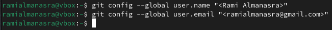{#fig:001 width=70%} 

Настраиваю utf-8 в выводе сообщений git для корректного отображения символов (@fig:002) 

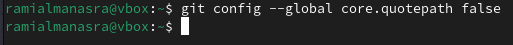{#fig:002 width=70%} 

Задаю имя «master» для начальной ветки (@fig:003) 

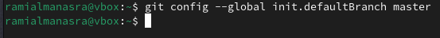{#fig:003 width=70%} 

Задаю параметр autocrlf со значением input и параметр safecrlf со значением warn (@fig:004) (@fig:005)

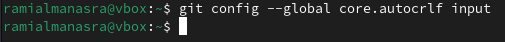{#fig:004 width=70%} 

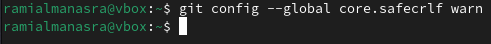{#fig:005 width=70%}

Для последующей идентификации пользователя на сервере репозиториев необходимо сгенерировать пару ключей (приватный и открытый). Для этого ввожу команду ssh-keygen -C “Имя Фамилия, work@email”, указывая имя владельца и электронную почту владельца (@fig:006). Ключ автоматически сохранится в каталоге ~/.ssh/.

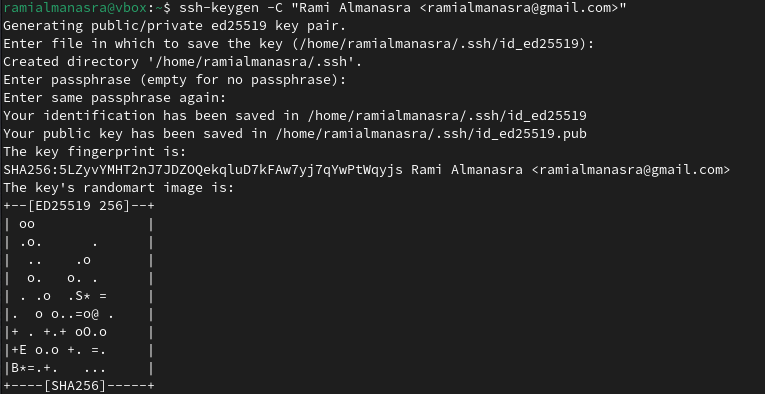{#fig:006 width=70%}

Xclip – утилита, позволяющая скопировать любой текст через терминал. Оказывается, в дистрибутиве Linux Fedora ее сначала надо установить.
Устанавливаю xclip с помощью команды dnf install с ключом -y отимени суперпользователя, введя в начале команды sudo (@fig:007)

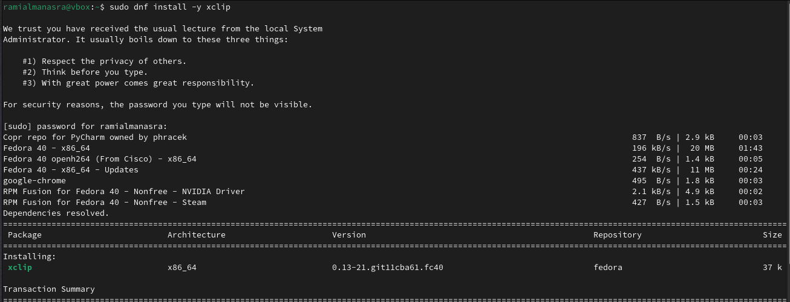{#fig:007 width=70%}

Копирую открытый ключ из директории, в которой он был сохранен, с помощью утилиты xclip (@fig:008)

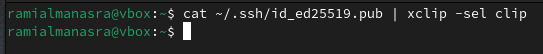{#fig:008 width=70%}

Открываю браузер, захожу на сайт GitHub. Открываю свой профиль и выбираю страницу «SSH and GPG keys». Нажимаю кнопку «New SSH key» (@fig:009)

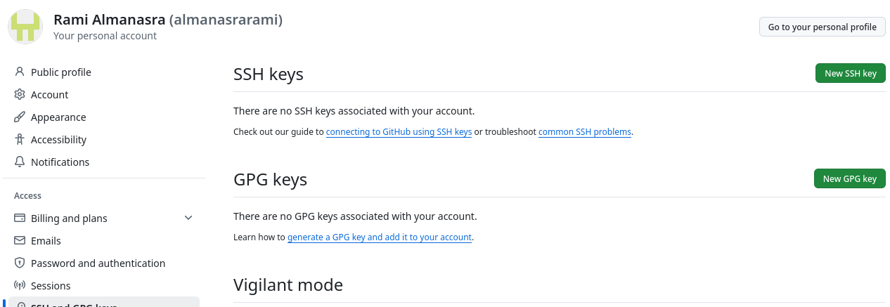{#fig:009 width=70%}

Вставляю скопированный ключ в поле «Key». В поле Title указываю имя для ключа. Нажимаю «Add SSH-key», чтобы завершить добавление ключа (@fig:010)

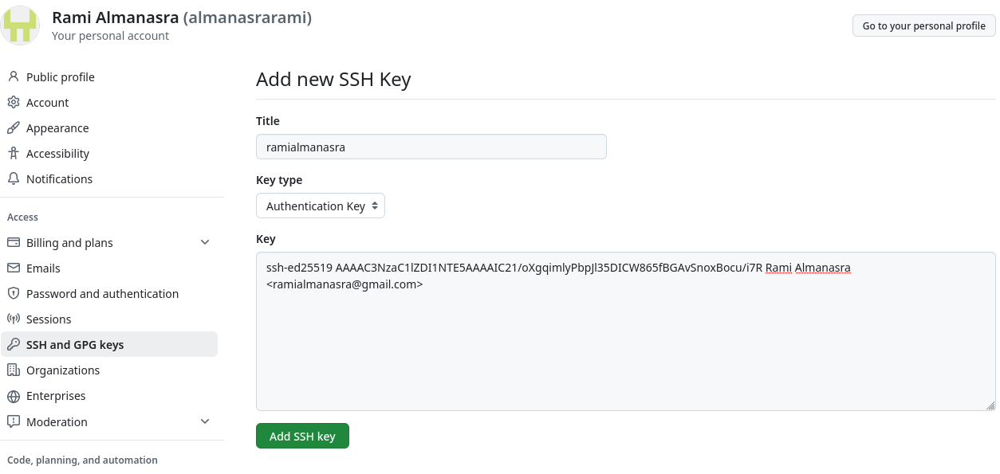{#fig:010 width=70%}

Закрываю браузер, открываю терминал. Создаю директорию, рабочее пространство, с помощью утилиты mkdir, блягодаря ключу -p создаю все директории после домашней ~/work/study/2024-2025/“ Операционные системы” рекурсивно. Далее проверяю с помощью ls, действительно ли были созданы необходимые мне каталоги (@fig:011)

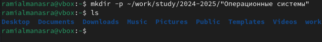{#fig:011 width=70%}

В браузере перехожу на страницу репозитория с шаблоном курса по адресу https://github.com/yamadharma/course-directory-student-template. Далее выбираю «Use this template», чтобы использовать этот шаблон для своего репозитория (@fig:012)

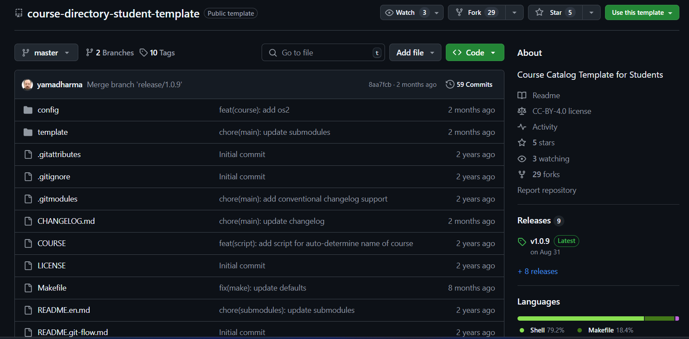{#fig:012 width=70%}

В открывшемся окне задаю имя репозитория (Repository name): study_2024–2025_os intro и создаю репозиторий, нажимаю на кнопку «Create repository from template» (@fig:013)

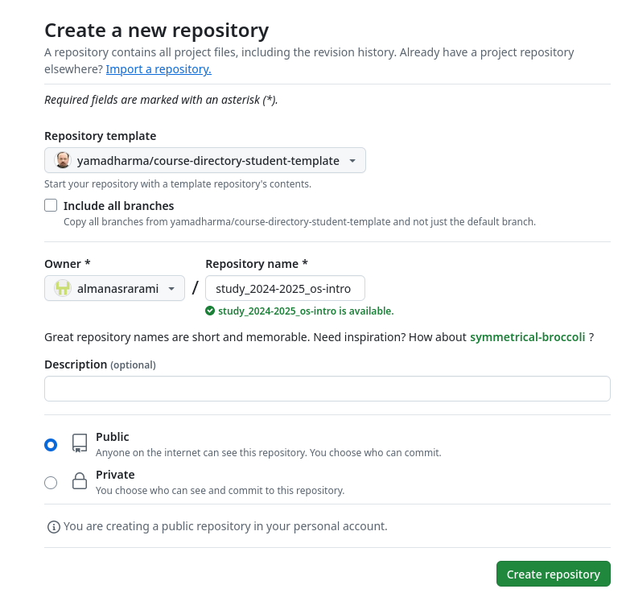{#fig:013 width=70%}

Через терминал перехожу в созданный каталог курса с помощью утилиты cd (@fig:014) и Клонирую созданный репозиторий с помощью команды git clone –recursive git@github.com:/study_2024–2025_os-intro.git os-intro (@fig:015)

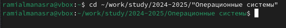{#fig:014 width=70%}

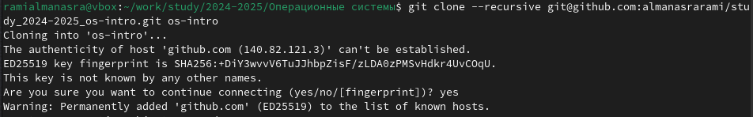{#fig:015 width=70%}

Копирую ссылку для клонирования на странице созданного репозитория, сначала перейдя в окно «code», далее выбрав в окне вкладку «SSH» (@fig:016)

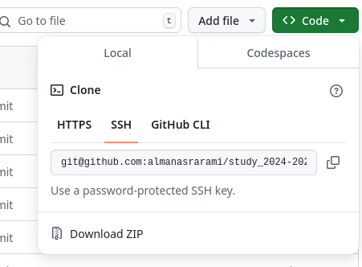{#fig:016 width=70%}

Перехожу в каталог os-intro с помощью утилиты cd (@fig:017) и Удаляю лишние файлы с помощью утилиты rm (@fig:018)

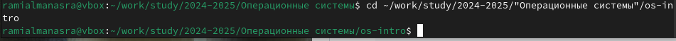{#fig:017 width=70%}

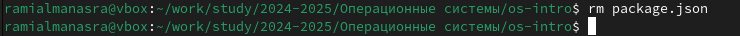{#fig:018 width=70%}

Создаю необходимые каталоги (@fig:019)

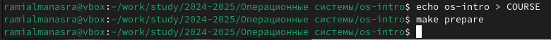{#fig:019 width=70%}

Отправляю созданные каталоги с локального репозитория на сервер: добавляю все созданные каталоги с помощью git add, комментирую и сохраняю изменения на сервере как добавление курса с помощью git commit (@fig:020)

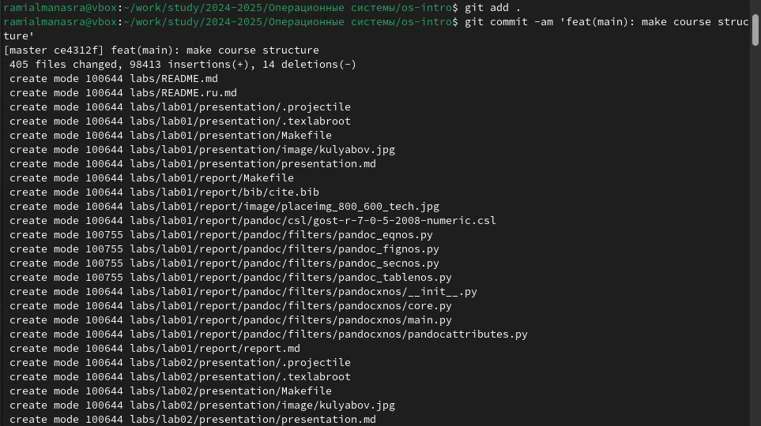{#fig:020 width=70%}

Отправляю все на сервер с помощью push (@fig:021)

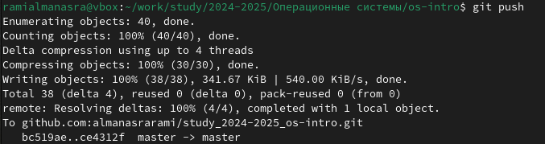{#fig:021 width=70%}

Проверяю правильность выполнения работы сначала на самом сайте GitHub (@fig:022) 

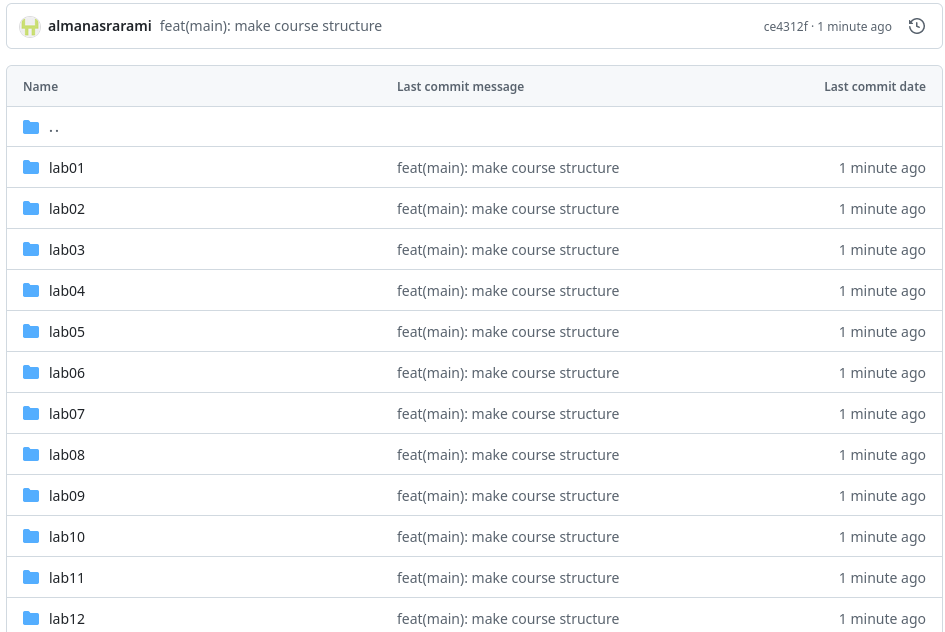{#fig:022 width=70%}

# Задание для самостоятельной работы

1. Перехожу в директорию labs/lab02/report с помощью утилиты cd. Создаю в каталоге файл для отчета по второй лабораторной работе с помощью 
утилиты touch (@fig:023) 

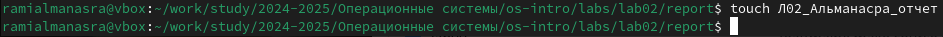{#fig:023 width=70%}

Оформить отчет я смогу в текстовом процессоре LibreOffice Writer, найдя его в меню приложений (@fig:024) 

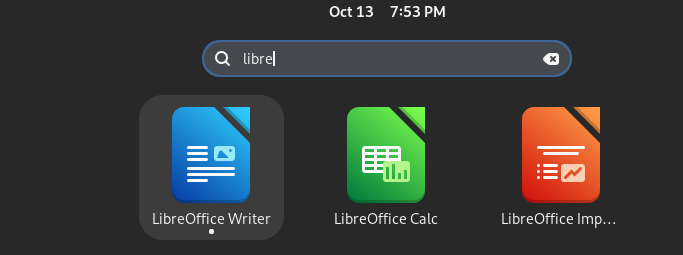{#fig:024 width=70%}

После открытия текстового процессора открываю в нем созданный файл и могу начать в нем работу над отчетом (@fig:025)

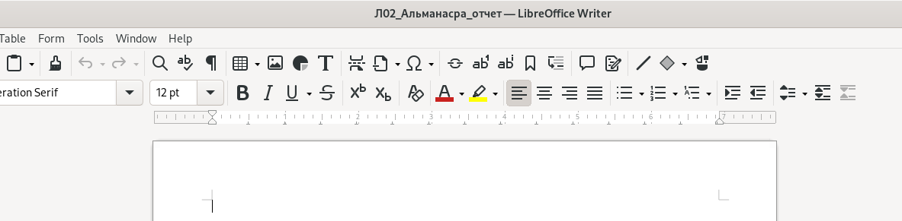{#fig:025 width=70%}

2. Перехожу из подкаталога lab02/report в подкаталог lab01/report с помощью утилиты cd (@fig:026) и Проверяю местонахождение файла с отчетом по первой лабораторной работой. Он должен быть в подкаталоге домашней директории «Downloads», для проверки использую команду ls (@fig:027)

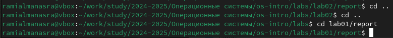{#fig:026 width=70%}

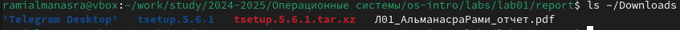{#fig:027 width=70%}

Копирую первую лабораторную с помощью утилиты cp и проверяю правильность выполнения команды cp с помощью ls (@fig:028)

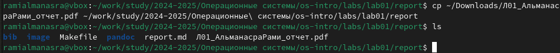{#fig:028 width=70%}

Добавляю с помощью команды git add в коммит созданные файлы: Л02_Альманасра_отчет (@fig:029)

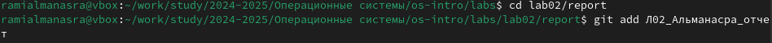{#fig:029 width=70%}

Сохраняю изменения с помощью git commit (@fig:030)

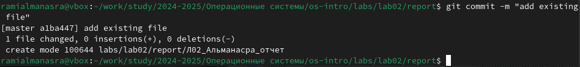{#fig:030 width=70%}

Отправляю в центральный репозиторий сохраненные изменения командой git push -f origin master (@fig:031)

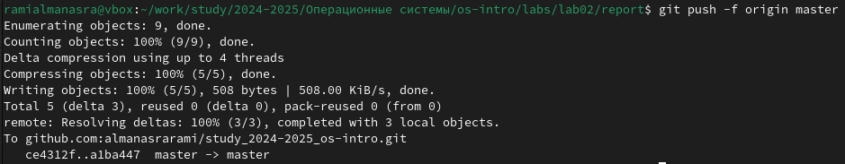{#fig:031 width=70%}

Проверяю на сайте GitHub правильность выполнения заданий. Вижу, что пояснение к совершенным действиям отображается (@fig:032)

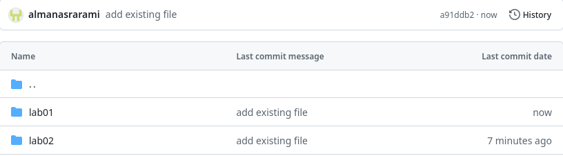{#fig:032 width=70%}

При просмотре изменений так же вижу, что были добавлены файлы с отчетами по лабораторным работам (@fig:033)

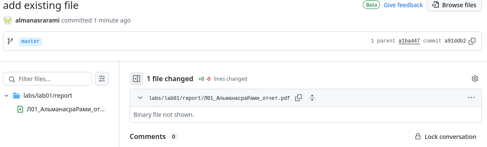{#fig:033 width=70%}

# Выводы

При выполнении данной лабораторной работы я изучила идеологию и применение средств контроля версий, а также приобрела практические навыки по работе с системой git.

# Список литературы

1. [Course on TUIS](https://esystem.rudn.ru/course/view.php?id=112)
2. [Laboratory work No. 2](https://esystem.rudn.ru/pluginfile.php/2089083/mod_resource/content/0/%D0%9B%D0%B0%D0%B1%D0%BE%D1%80%D0%B0%D1%82%D0%BE%D1%80%D0%BD%D0%B0%D1%8F%20%D1%80%D0 %B0%D0%B1%D0%BE%D1%82%D0%B0%20%E2%84%963.%20%D0%AF%D0%B7%D1%8B%D0%BA%20%D1%80%D0%B0%D0%B7%D0%BC%D0%B5%D1%82%D0%BA%D0%B8%20.pdf) 
