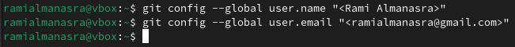
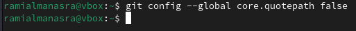
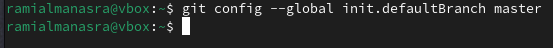
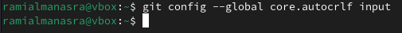
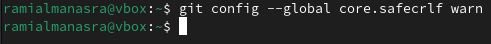
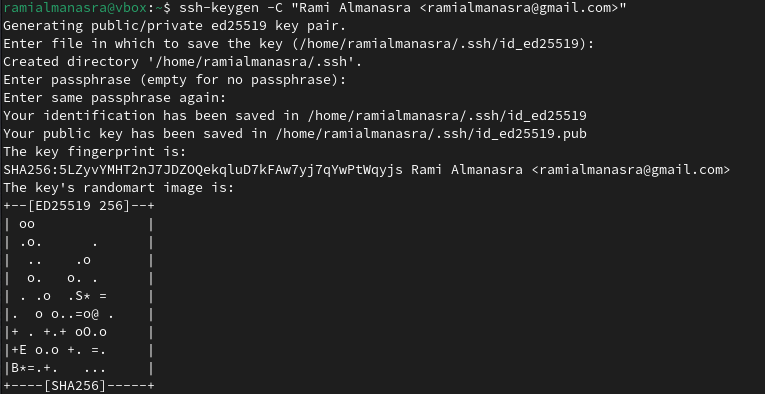
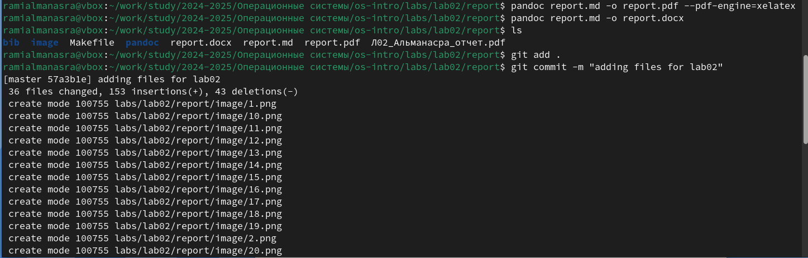
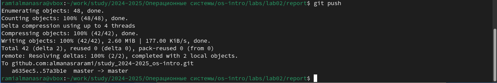

---
##Front matter
title: "Лабораторная работа №3"
subtitle: "Архитектура ЭВМ"
author: "Альманасра Рами"

##Generic options
long: ru-RU
toc-title: "Content"

## Generic otions
lang: ru-RU
toc-title: "Content"

## Bibliography
bibliography: bib/cite.bib
csl: pandoc/csl/gost-r-7-0-5-2008-numeric.csl

## Pdf output format
toc: true # Table of contents
toc-depth: 2
lof: true # List of figures
lot: true # List of tables
fontsize: 12pt
linestretch: 1.5
papersize: a4
documentclass: scrreprt
## I18n polyglossia
polyglossia-lang:
  name: russian
  options:
	- spelling=modern
	- babelshorthands=true
polyglossia-otherlangs:
  name: english
## I18n babel
babel-lang: russian
babel-otherlangs: english
## Fonts
mainfont: IBM Plex Serif
romanfont: IBM Plex Serif
sansfont: IBM Plex Sans
monofont: IBM Plex Mono
mathfont: STIX Two Math
mainfontoptions: Ligatures=Common,Ligatures=TeX,Scale=0.94
romanfontoptions: Ligatures=Common,Ligatures=TeX,Scale=0.94
sansfontoptions: Ligatures=Common,Ligatures=TeX,Scale=MatchLowercase,Scale=0.94
monofontoptions: Scale=MatchLowercase,Scale=0.94,FakeStretch=0.9
mathfontoptions:
## Biblatex
biblatex: true
biblio-style: "gost-numeric"
biblatexoptions:
  - parentracker=true
  - backend=biber
  - hyperref=auto
  - language=auto
  - autolang=other*
  - citestyle=gost-numeric
## Pandoc-crossref LaTeX customization
figureTitle: "Pic."
tableTitle: "Таble"
listingTitle: "Listing"
lofTitle: "Illustration list"
lotTitle: "Table list"
lolTitle: "Listing"
## Misc options
indent: true
header-includes:
  - \usepackage{indentfirst}
  - \usepackage{float} # keep figures where there are in the text
  - \floatplacement{figure}{H} # keep figures where there are in the text
---

# Цель работы

Целью работы является освоение процедуры оформления отчетов с помощью легковесного языка разметки Markdown.
 
# Задание

-установка необходимого программного обеспечения

-заполнение отчета о лабораторной работе №3 с использованием языка разметки markdown

-задание для самостоятельной работы

# Теоретическое введение

Markdown - это облегченный язык разметки, предназначенный для обозначения форматирования в виде обычного текста с максимальной удобочитаемостью для человека и пригодный для машинного преобразования в языки для продвинутых публикаций (HTML, Rich Text и другие).

# Выполнение лабораторной работы

Открывю терминал, перехожу в каталог курса сформированный при выполнении лабораторной работы №2 и обновляю локальный репозиторий, скачав изменения из удаленного репозитория с помощью команды git pull. (@fig:001)

{#fig:001 width=70%} 

Перехожу в каталог с шаблоном отчета по лабораторной работе № 3 и компилирую шаблона с использованием команду make (fig:002). Проверяю правильность выполнения команды с помощью команды ls (@fig:003) 

{#fig:002 width=70%} 

{#fig:003 width=70%} 

Удаляю сгенерированные файлы с помощью команды make clean (@fig:004) 

{#fig:004 width=70%} 

 Открываю файл report.md c помощью текстового редактора gedit (@fig:005)

{#fig:005 width=70%}

# Задание для самостоятельной работы

В соответствующем каталоге делаю отчёт по лабораторной работе №2 в формате Markdown. (@fig:006)

{#fig:006 width=70%}

Сохраняю отчет в markdown, делаю файлы pdf,docx из markdown (@fig:007) и отправляю в репозиторий (@fig:008)

{#fig:007 width=70%}

{#fig:008 width=70%}

# Выводы

В результате прохождения этой лабораторной работы я освоил процедуры подготовки отчетов с использованием облегченного языка разметки Markdown.

# Список литературы

1. [Course on TUIS](https://esystem.rudn.ru/course/view.php?id=112)
2. [Laboratory work No. 3](https://esystem.rudn.ru/pluginfile.php/2089083/mod_resource/content/0/%D0%9B%D0%B0%D0%B1%D0%BE%D1%80%D0%B0%D1%82%D0%BE%D1%80%D0%BD%D0%B0%D1%8F%20%D1%80%D0 %B0%D0%B1%D0%BE%D1%82%D0%B0%20%E2%84%963.%20%D0%AF%D0%B7%D1%8B%D0%BA%20%D1%80%D0%B0%D0%B7%D0%BC%D0%B5%D1%82%D0%BA%D0%B8%20.pdf) 3 . [Example of lab work](https://github.com/evdvorkina/study_2022-2023_arh-pc/blob/master/labs/lab04/report/%D0%9B04_%D0%94%D0%B2%D0%BE%D1%80%D0%BA%D0%B8%D0%BD%D0%B0_%D0%BE%D1%82%D1%87%D0%B5%D1%82.md?plain=1)
