# Отчёта по лабораторной работе No 4

## Дисциплина: архитектура компьютера

```
Альманасра Рами
```
## 1 Цель работы

Цель данной лабораторной работы - освоить процедуры компиляции и сборки
программ, написанных на ассемблере NASM.

## 2 Задание

- Создание программы Hello world!
- Работа с транслятором NASM
- Работа с расширенным синтаксисом командной строки NASM
- Работа с компоновщиком LD
- Запуск исполняемого файла
- Выполнение заданий для самостоятельной работы.

## 3 Теоретическое введение

Основными функциональными элементами любой ЭВМ являются центральный
процессор, память и периферийные устройства. Взаимодействие этих устройств
осуществляется через общую шину, к которой они подключены. Физически шина
представляет собой большое количество проводников, соединяющих устройства
друг с другом. В современных компьютерах проводники выполнены в виде
электропроводящих дорожек на материнской плате. Основной задачей
процессора является обработка информации, а также организация координации
всех узлов компьютера. В состав центрального процессора входят следующие
устройства: - арифметико-логическое устройство (АЛУ) — выполняет логические
и арифметические действия, необходимые для обработки информации,
хранящейся в памяти; - устройство управления (УУ) — обеспечивает управление
и контроль всех устройств компьютера; - регистры — сверхбыстрая оперативная
память небольшого объёма, входящая в состав процессора, для временного
хранения промежуточных результатов выполнения инструкций; регистры
процессора делятся на два типа: регистры общего назначения и специальные
регистры. Для того, чтобы писать программы на ассемблере, необходимо знать,
какие регистры процессора существуют и как их можно использовать.
Большинство команд в программах написанных на ассемблере используют
регистры в каче- стве операндов. Практически все команды представляют собой
преобразование данных хранящихся в регистрах процессора, это например
пересылка данных между регистрами или между регистрами и памятью,
преобразование (арифметические или логические операции) данных хранящихся


в регистрах. Доступ к регистрам осуществляется не по адресам, как к основной
памяти, а по именам. Каждый регистр процессора архитектуры x86 имеет свое
название, состоящее из 2 или 3 букв латинского алфавита. В качестве примера
приведем названия основных регистров общего назначения (именно эти
регистры чаще всего используются при написании программ): - RAX, RCX, RDX,
RBX, RSI, RDI — 64 - битные - EAX, ECX, EDX, EBX, ESI, EDI — 32 - битные - AX, CX, DX,
BX, SI, DI — 16 - битные - AH, AL, CH, CL, DH, DL, BH, BL — 8 - битные

Другим важным узлом ЭВМ является оперативное запоминающее устройство
(ОЗУ). ОЗУ — это быстродействующее энергозависимое запоминающее
устройство, которое напрямую взаимодействует с узлами процессора,
предназначенное для хранения программ и данных, с которыми процессор
непосредственно работает в текущий момент. ОЗУ состоит из одинаковых
пронумерованных ячеек памяти. Номер ячейки памяти — это адрес хранящихся в
ней данных. Периферийные устройства в составе ЭВМ: - устройства внешней
памяти, которые предназначены для долговременного хранения больших
объёмов данных. - устройства ввода-вывода, которые обеспечивают
взаимодействие ЦП с внешней средой.

В основе вычислительного процесса ЭВМ лежит принцип программного
управления. Это означает, что компьютер решает поставленную задачу как
последовательность действий, записанных в виде программы.

Коды команд представляют собой многоразрядные двоичные комбинации из 0 и

1. В коде машинной команды можно выделить две части: операционную и
адресную. В операционной части хранится код команды, которую необходимо
выполнить. В адресной части хранятся данные или адреса данных, которые
участвуют в выполнении данной операции. При выполнении каждой команды
процессор выполняет определённую последовательность стандартных действий,
которая называется командным циклом процессора. Он заключается в
следующем: 1. формирование адреса в памяти очередной команды; 2. считывание
кода команды из памяти и её дешифрация; 3. выполнение команды; 4. переход к
следующей команде.

Язык ассемблера (assembly language, сокращённо asm) — машинно-
ориентированный язык низкого уровня. NASM — это открытый проект
ассемблера, версии которого доступны под различные операционные системы и
который позволяет получать объектные файлы для этих систем. В NASM
используется Intel-синтаксис и поддерживаются инструкции x 86 - 64.

## 4 Выполнение лабораторной работы

### 4.1 Создание программы Hello world!

С помощью утилиты cd перемещаюсь в каталог, в котором буду работать (рис. 1).

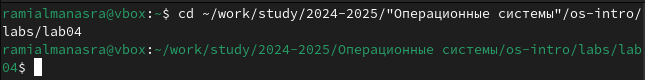{#fig:001 width=70%}


Создаю в текущем каталоге пустой текстовый файл hello.asm с помощью утилиты
touch (рис. 2).

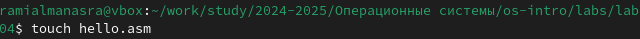{#fig:002 width=70%}

Открываю созданный файл в текстовом редакторе gedit (рис. 3).

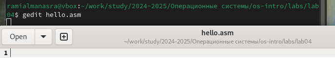{#fig:003 width=70%}

Заполняю файл, вставляя в него программу для вывода “Hello word!” (рис. 4).

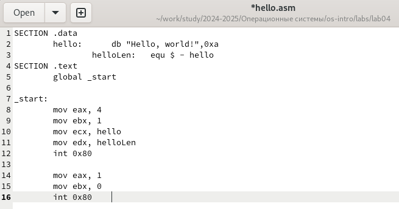{#fig:004 width=70%}

### 4.2 Работа с транслятором NASM

Превращаю текст программы для вывода “Hello world!” в объектный код с
помощью транслятора NASM, используя команду nasm - f elf hello.asm, ключ -f


указывает транслятору nasm, что требуется создать бинарный файл в формате
ELF (рис. 5). Далее проверяю правильность выполнения команды с помощью
утилиты ls: действительно, создан файл “hello.o”.

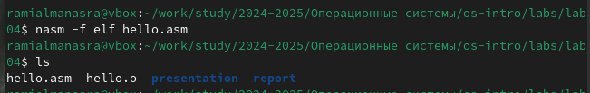{#fig:005 width=70%}

### 4.3 Работа с расширенным синтаксисом командной строки NASM

Ввожу команду, которая скомпилирует файл hello.asm в файл obj.o, при этом в
файл будут включены символы для отладки (ключ -g), также с помощью ключа -l
будет создан файл листинга list.lst (рис. 6). Далее проверяю с помощью утилиты ls
правильность выполнения команды.

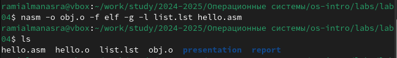{#fig:006 width=70%}

### 4.4 Работа с компоновщиком LD

Передаю объектный файл hello.o на обработку компоновщику LD, чтобы
получить исполняемый файл hello (рис. 7). Ключ -о задает имя создаваемого
исполняемого файла. Далее проверяю с помощью утилиты ls правильность
выполнения команды.

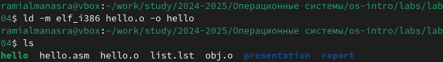{#fig:007 width=70%}

Выполняю следующую команду (рис. 8). Исполняемый файл будет иметь имя
main, т.к. после ключа -о было задано значение main. Объектный файл, из
которого собран этот исполняемый файл, имеет имя obj.o

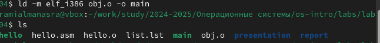{#fig:008 width=70%}

### 4.5 Запуск исполняемого файла

Запускаю на выполнение созданный исполняемый файл hello (рис. 9).

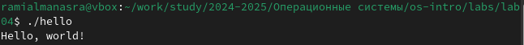{#fig:009 width=70%}

### 4.6 Выполнение заданий для самостоятельной работы.

С помощью утилиты cp создаю в текущем каталоге копию файла hello.asm с
именем lab 4 .asm (рис. 10).

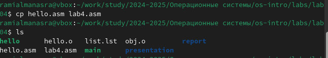{#fig:010 width=70%}

С помощью текстового редактора gedit открываю файл lab 4 .asm и вношу
изменения в программу так, чтобы она выводила мои имя и фамилию. (рис. 11).

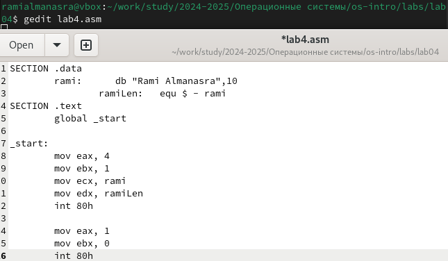{#fig:011 width=70%}

Компилирую текст программы в объектный файл (рис. 12). Проверяю с помощью
утилиты ls, что файл lab 4 .o создан.

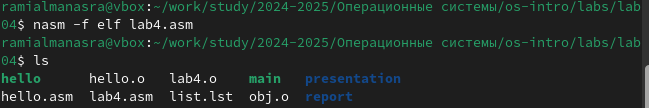{#fig:012 width=70%}

Передаю объектный файл lab 4 .o на обработку компоновщику LD, чтобы получить
исполняемый файл lab 4 (рис. 13).

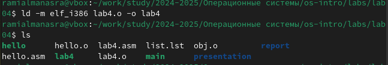{#fig:013 width=70%}

Запускаю исполняемый файл lab 4 , на экран действительно выводятся мои имя и
фамилия (рис. 14).

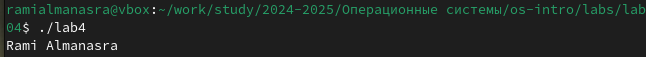{#fig:014 width=70%}

С помощью команд git add. и git commit добавляю файлы на GitHub, комментируя
действие как добавление файлов для лабораторной работы No 4 (рис. 17).

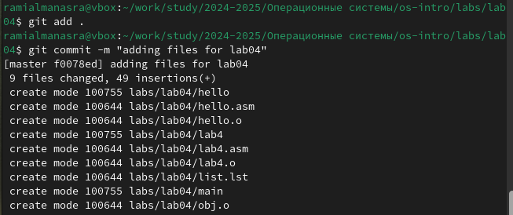{#fig:017 width=70%}

Отправляю файлы на сервер с помощью команды git push (рис. 18).

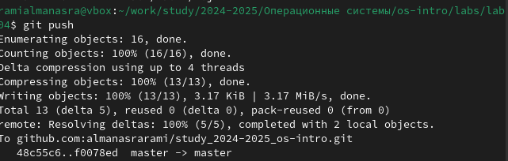{#fig:018 width=70%}

## 5 Выводы

При выполнении данной лабораторной работы я освоила процедуры компиляции
и сборки программ, написанных на ассемблере NASM.

## 6 Список литературы

- https://esystem.rudn.ru/pluginfile.php/1584628/mod_resource/content/1/%D
    0%9B%D0%B0%D0%B1%D0%BE%D1%80%D0%B0%D1%82%D0%BE%D
    %80%D0%BD%D0%B0%D1%8F%20%D1%80%D0%B0%D0%B1%D0%BE%
    D1%82%D0%B0%20%E2%84%965.pdf


