---
## Front matter
title: "Лабораторная работа №5"
subtitle: "Архитектура ЭВМ"
author: "Альманасра Рами"

## Generic otions
lang: ru-RU
toc-title: "Content"

## Bibliography
bibliography: bib/cite.bib
csl: pandoc/csl/gost-r-7-0-5-2008-numeric.csl

## Pdf output format
toc: true # Table of contents
toc-depth: 2
lof: true # List of figures
lot: true # List of tables
fontsize: 12pt
linestretch: 1.5
papersize: a4
documentclass: scrreprt
## I18n polyglossia
polyglossia-lang:
  name: russian
  options:
	- spelling=modern
	- babelshorthands=true
polyglossia-otherlangs:
  name: english
## I18n babel
babel-lang: russian
babel-otherlangs: english
## Fonts
mainfont: IBM Plex Serif
romanfont: IBM Plex Serif
sansfont: IBM Plex Sans
monofont: IBM Plex Mono
mathfont: STIX Two Math
mainfontoptions: Ligatures=Common,Ligatures=TeX,Scale=0.94
romanfontoptions: Ligatures=Common,Ligatures=TeX,Scale=0.94
sansfontoptions: Ligatures=Common,Ligatures=TeX,Scale=MatchLowercase,Scale=0.94
monofontoptions: Scale=MatchLowercase,Scale=0.94,FakeStretch=0.9
mathfontoptions:
## Biblatex
biblatex: true
biblio-style: "gost-numeric"
biblatexoptions:
  - parentracker=true
  - backend=biber
  - hyperref=auto
  - language=auto
  - autolang=other*
  - citestyle=gost-numeric
## Pandoc-crossref LaTeX customization
figureTitle: "Рис."
tableTitle: "Таблица"
listingTitle: "Листинг"
lofTitle: "Список иллюстраций"
lotTitle: "Список таблиц"
lolTitle: "Листинги"
## Misc options
indent: true
header-includes:
  - \usepackage{indentfirst}
  - \usepackage{float} # keep figures where there are in the text
  - \floatplacement{figure}{H} # keep figures where there are in the text
---
# Цель работы

Целью данной лабораторной работы является приобретение практических навыков использования Midnight Commander и изучение основных инструкций языка ассемблера: mov и int.

# Задание

1. Основы работы с Midnight Commander.

2. Структура программы, написанной на языке ассемблера NASM

3. Подключение внешнего файла

4. Выполнение заданий для самостоятельной работы

# Теоретическое введение

Midnight Commander (или просто mc) - это программа, которая позволяет пользователям просматривать структуры каталогов и выполнять основные операции по управлению файловой системой. Таким образом, mc функционирует как файловый менеджер. Midnight Commander делает работу с файлами более удобной и визуально понятной.

Программа, написанная на языке ассемблера NASM, обычно состоит из трех разделов: раздел программного кода (SECTION.text), раздел инициализированных данных (известный во время компиляции) (SECTION.data) и раздел неинициализированных данных (для которых выделяется память во время компиляции, но присваивает значения во время выполнения программы) (SECTION.bss).

Для объявления инициализированных данных в разделе .data используются директивы DB, DW, DD, DQ и Используются DT, которые резервируют память и указывают, какие значения должны храниться в этой памяти:

- DB (define byte) — определяет переменную размером в 1 байт;
- DW (define word) — определяет переменную размером в 2 байта (word);
- DD (define double word) — определяет переменную размером 4 байта (double word);
- DQ (define quad word) — определяет переменную размером 8 байт (quad word);
- DT (define ten bytes) — определяет переменную размером 10 байт.

## Выполнение лабораторной работы

### Основы работы с Midnight Commander

Введя соответствующую команду в терминале (Figure -@fig:001), я открываю Midnight Commander (Figure -@fig:002).

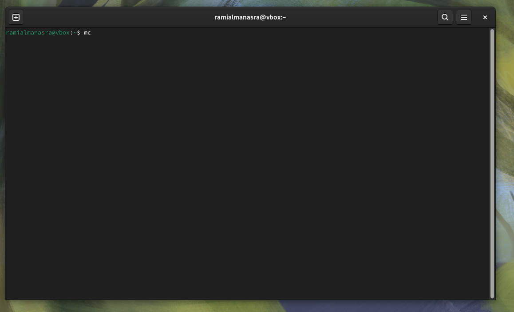{#fig:001 width=70%}

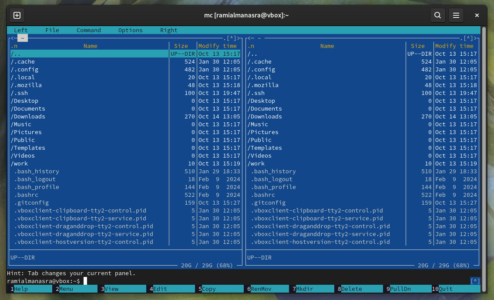{#fig:002 width=70%}

Я перехожу к каталогу, созданному в ходе предыдущей лабораторной работы (Figure -@fig:003).

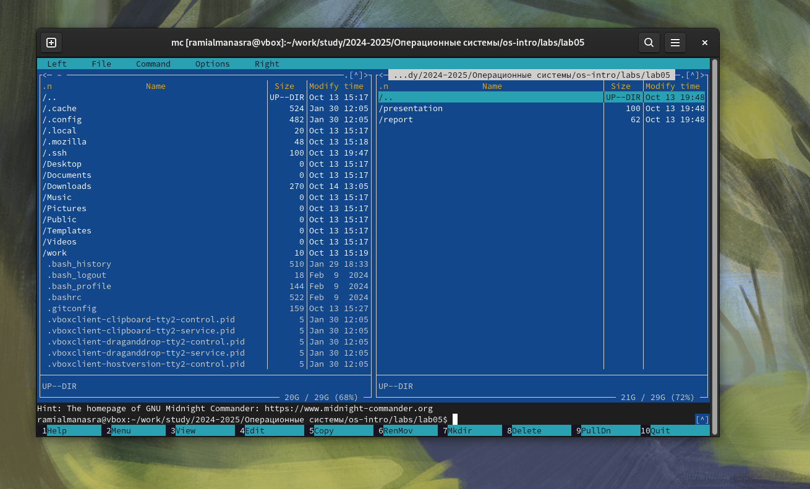{#fig:003 width=70%}

Используя функциональную клавишу f7, я создаю подкаталог lab05, и перейду в созданный каталог (Figure -@fig:004).

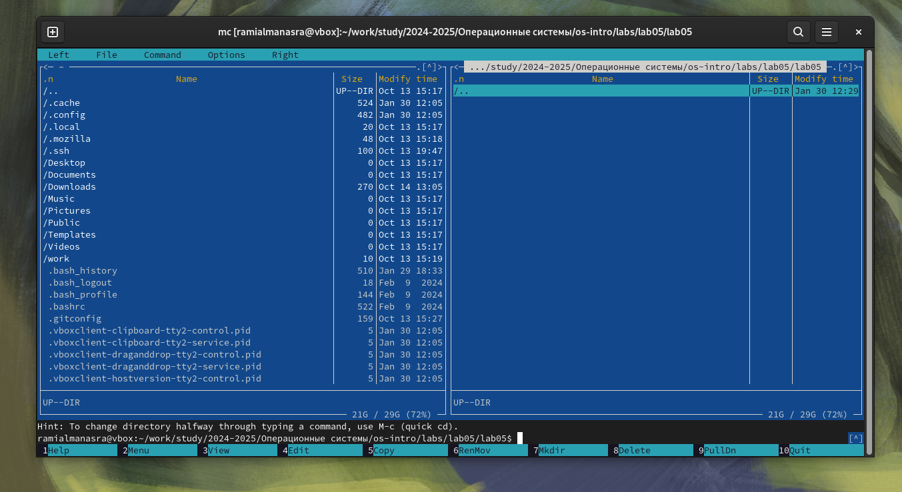{#fig:004 width=70%}

В строке ввода я ввожу команду `touch` и создаю файл lab5-1.asm (Figure -@fig:005).

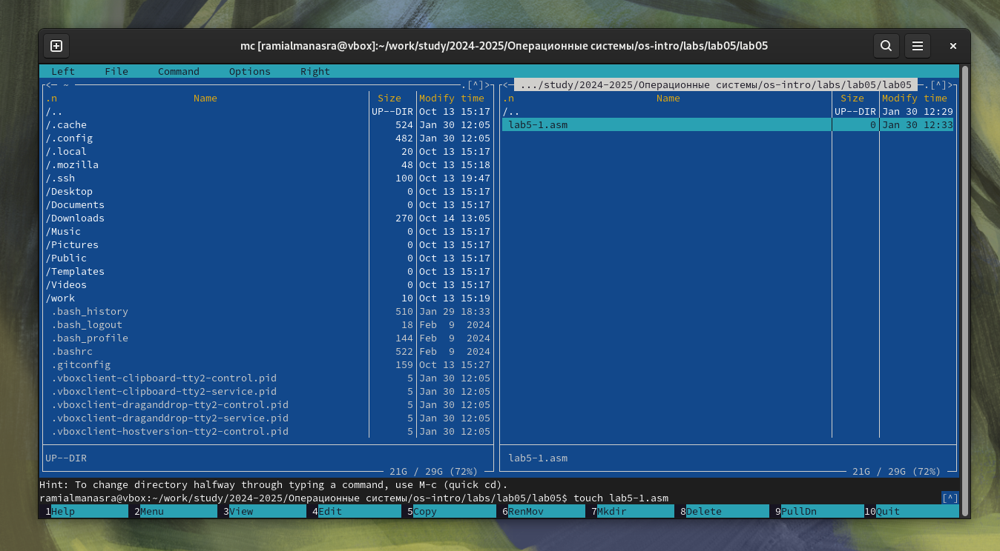{#fig:005 width=70%}

Я использую клавишу F4, чтобы открыть вновь созданный файл и ввести код из списка (Figure -@fig:006).

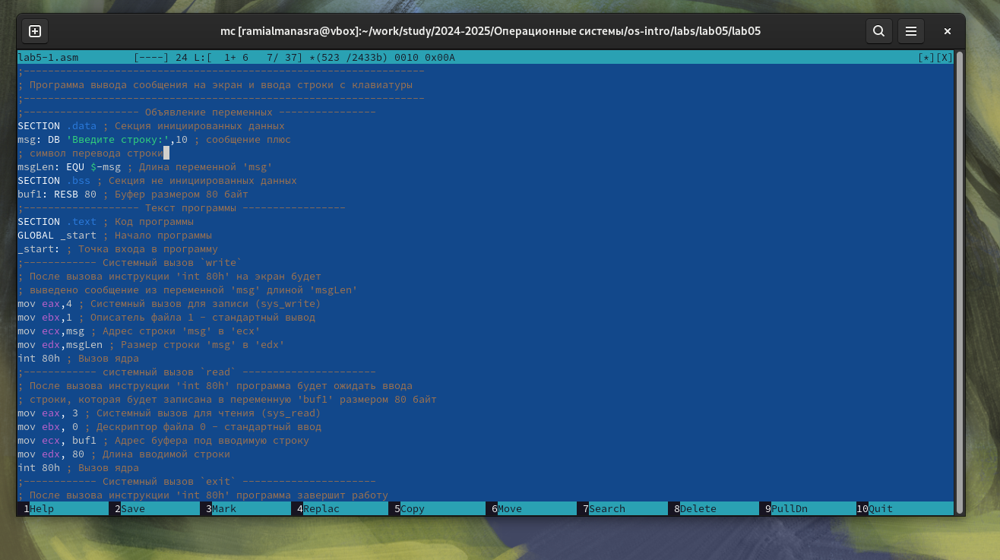{#fig:006 width=70%}

Я проверяю сохраненные изменения с помощью клавиши F3 (Figure -@fig:007).

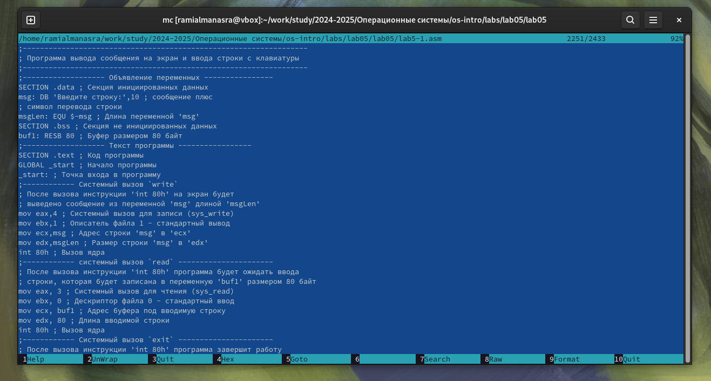{#fig:007 width=70%}

Я компилирую и запускаю измененный файл (Figure -@fig:008).

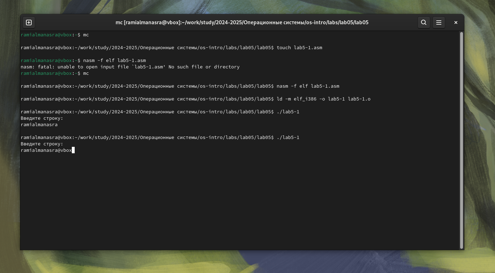{#fig:008 width=70%}

### Подключение внешнего файла

Я сохраняю файл, загруженный из TUIS, в общую папку на своем компьютере, затем на виртуальной машине захожу в каталог общей папки, копирую файл в рабочий подкаталог (Figure -@fig:009).

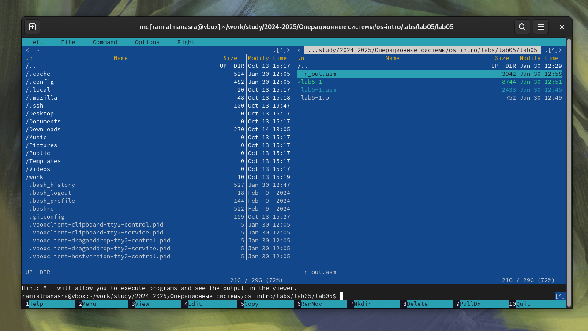{#fig:009 width=70%}

С помощью функциональной клавиши F6 создаю копию файла lab5-1.asm с именем
lab5-2.asm (Figure -@fig:0010).

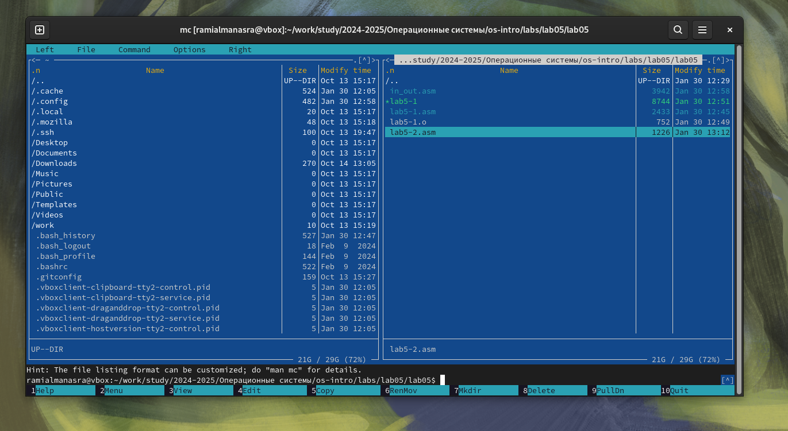{#fig:010 width=70%}

Я включаю подпрограммы из включенного файла в копию файла (Figure -@fig:011).

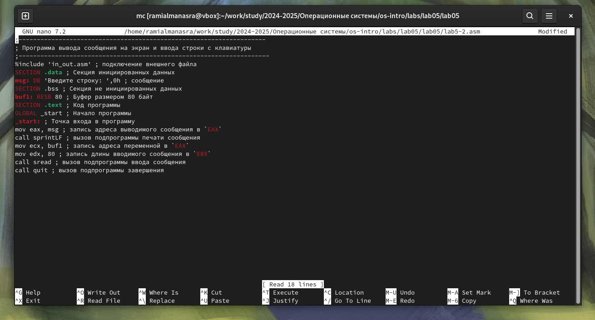{#fig:011 width=70%}

Я компилирую и запускаю программу с прилагаемым файлом (Figure -@fig:012).

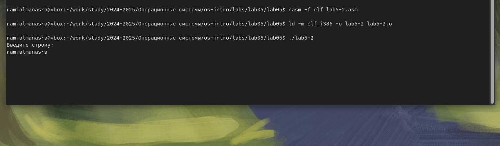{#fig:012 width=70%}

Я редактирую файл и заменяю подпрограмму "sprintLF" на "sprint". Разница между двумя подпрограммами заключается в том, что вторая запрашивает ввод в той же строке (Figure -@fig:013).

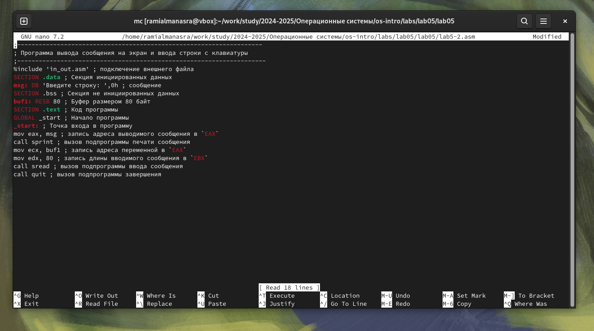{#fig:013 width=70%}

## Задание для самостоятельной работы

Я создаю копию lab 5-1.asm, редактируя ее так, чтобы строка, которую я ввел с клавиатуры, отображалась в конце (Figure -@fig:014).

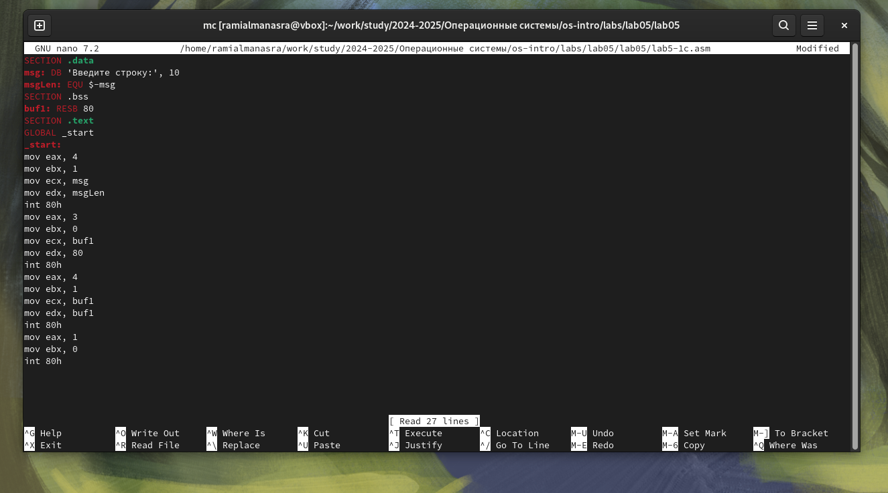{#fig:014 width=70%}

Я компилирую и запускаю программу (Figure -@fig:015).

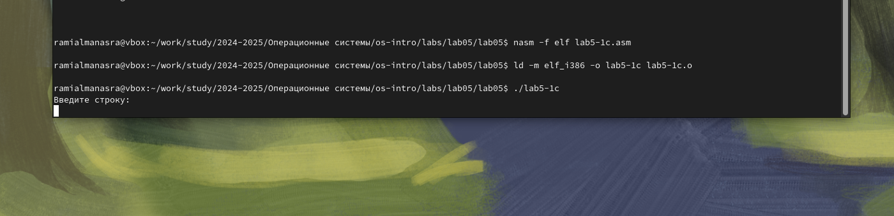{#fig:015 width=70%}

код:

SECTION .data
msg: DB 'Введите строку:', 10
msgLen: EQU $-msg
SECTION .bss
buf1: RESB 80
SECTION .text
GLOBAL _start
_start:
mov eax, 4
mov ebx, 1
mov ecx, msg
mov edx, msgLen
int 80h
mov eax, 3
mov ebx, 0
mov ecx, buf1
mov edx, 80
int 80h
mov eax, 4
mov ebx, 1
mov ecx, buf1
mov edx, buf1
int 80h
mov eax, 1
mov ebx, 0
int 80h

Я создаю копию lab 5-2.asm, редактирую ее так, чтобы строка, которую я ввел с клавиатуры, отображалась в конце (Fig. -@fig:016).

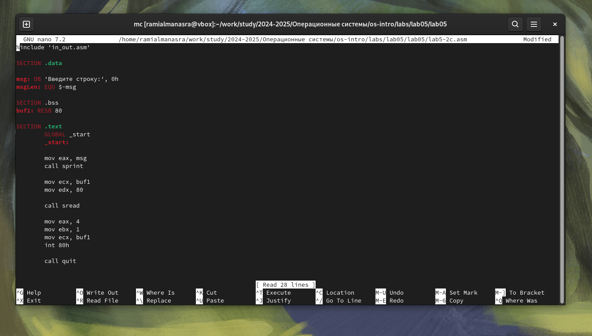{#fig:016 width=70%}

Я компилирую и запускаю программу (Fig. -@fig:017).

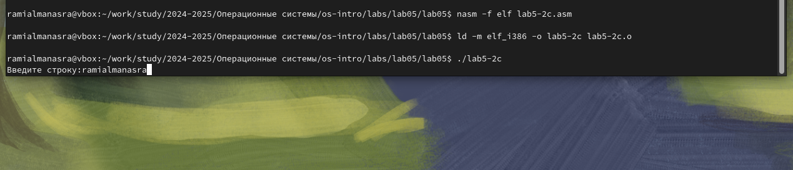{#fig:017 width=70%}

код:

%include 'in_out.asm'

SECTION .data

msg: DB 'Введите строку:', 0h
msgLen: EQU $-msg

SECTION .bss
buf1: RESB 80

SECTION .text
	GLOBAL _start
	_start:

	mov eax, msg
	call sprint

	mov ecx, buf1
	mov edx, 80

	call sread

	mov eax, 4
	mov ebx, 1
	mov ecx, buf1
	int 80h

	call quit

# Выводы

Во время этой лабораторной работы я приобрел практические навыки работы в Midnight Commander, а также освоил инструкции на языках ассемблера mov и int.

# Список литературы

1. [sample](https://github.com/evdvorkina/study_2022-2023_arh-pc/blob/master/labs/lab06/report/%D0%9B06_%D0%94%D0%B2%D0%BE%D1%80%D0%BA%D0%B8%D0%BD%D0%B0_%D0%BE%D1%82%D1%87%D0%B5%D1%82.md?plain=1)
2. [course on tuis](https://esystem.rudn.ru/course/view.php?id=112)
3. [labrotary work №5](https://esystem.rudn.ru/pluginfile.php/2089085/mod_resource/content/0/%D0%9B%D0%B0%D0%B1%D0%BE%D1%80%D0%B0%D1%82%D0%BE%D1%80%D0%BD%D0%B0%D1%8F%20%D1%80%D0%B0%D0%B1%D0%BE%D1%82%D0%B0%20%E2%84%965.%20%D0%9E%D1%81%D0%BD%D0%BE%D0%B2%D1%8B%20%D1%80%D0%B0%D0%B1%D0%BE%D1%82%D1%8B%20%D1%81%20Midnight%20Commander%20%28%29.%20%D0%A1%D1%82%D1%80%D1%83%D0%BA%D1%82%D1%83%D1%80%D0%B0%20%D0%BF%D1%80%D0%BE%D0%B3%D1%80%D0%B0%D0%BC%D0%BC%D1%8B%20%D0%BD%D0%B0%20%D1%8F%D0%B7%D1%8B%D0%BA%D0%B5%20%D0%B0%D1%81%D1%81%D0%B5%D0%BC%D0%B1%D0%BB%D0%B5%D1%80%D0%B0%20NASM.%20%D0%A1%D0%B8%D1%81%D1%82%D0%B5%D0%BC%D0%BD%D1%8B%D0%B5%20%D0%B2%D1%8B%D0%B7%D0%BE%D0%B2%D1%8B%20%D0%B2%20%D0%9E%D0%A1%20GNU%20Linux.pdf)
4. [prograaming in nasmlanguage](https://esystem.rudn.ru/pluginfile.php/2088953/mod_resource/content/2/%D0%A1%D1%82%D0%BE%D0%BB%D1%8F%D1%80%D0%BE%D0%B2%20%D0%90.%20%D0%92.%20-%20%D0%9F%D1%80%D0%BE%D0%B3%D1%80%D0%B0%D0%BC%D0%BC%D0%B8%D1%80%D0%BE%D0%B2%D0%B0%D0%BD%D0%B8%D0%B5%20%D0%BD%D0%B0%20%D1%8F%D0%B7%D1%8B%D0%BA%D0%B5%20%D0%B0%D1%81%D1%81%D0%B5%D0%BC%D0%B1%D0%BB%D0%B5%D1%80%D0%B0%20NASM%20%D0%B4%D0%BB%D1%8F%20%D0%9E%D0%A1%20Unix.pdf)
