---
## Front matter
title: "Лабораторная работа №6"
subtitle: "Архитектура ЭВМ"
author: "Альманасра Рами"

## Generic otions
lang: ren-EN
toc-title: "Content"

## Bibliography
bibliography: bib/cite.bib
csl: pandoc/csl/gost-r-7-0-5-2008-numeric.csl

## Pdf output format
toc: true # Table of contents
toc-depth: 2
lof: true # List of figures
lot: true # List of tables
fontsize: 12pt
linestretch: 1.5
papersize: a4
documentclass: scrreprt
## I18n polyglossia
polyglossia-lang:
  name: russian
  options:
	- spelling=modern
	- babelshorthands=true
polyglossia-otherlangs:
  name: english
## I18n babel
babel-lang: russian
babel-otherlangs: english
## Fonts
mainfont: IBM Plex Serif
romanfont: IBM Plex Serif
sansfont: IBM Plex Sans
monofont: IBM Plex Mono
mathfont: STIX Two Math
mainfontoptions: Ligatures=Common,Ligatures=TeX,Scale=0.94
romanfontoptions: Ligatures=Common,Ligatures=TeX,Scale=0.94
sansfontoptions: Ligatures=Common,Ligatures=TeX,Scale=MatchLowercase,Scale=0.94
monofontoptions: Scale=MatchLowercase,Scale=0.94,FakeStretch=0.9
mathfontoptions:
## Biblatex
biblatex: true
biblio-style: "gost-numeric"
biblatexoptions:
  - parentracker=true
  - backend=biber
  - hyperref=auto
  - language=auto
  - autolang=other*
  - citestyle=gost-numeric
## Pandoc-crossref LaTeX customization
figureTitle: "Fig."
tableTitle: "Table"
listingTitle: "Listing"
lofTitle: "List of illustrations"
lotTitle: "List of Tables"
lolTitle: "Listings"
## Misc options
indent: true
header-includes:
  - \usepackage{indentfirst}
  - \usepackage{float} # keep figures where there are in the text
  - \floatplacement{figure}{H} # keep figures where there are in the text
---

# Цель работы

Освоение арифметических инструкций языка ассемблера NASM.

# Задание

1. Символьные и числовые данные в NASM
2. Выполнение арифметических операций в NASM
3. Выполнение заданий для самостоятельной работы

# Теоретическое введение

Большинство инструкций на языке ассемблера требуют обработки операндов.
Адрес операнда указывает местоположение, в котором хранятся обрабатываемые данные. Это могут быть данные, хранящиеся в регистре или в ячейке памяти. -
Регистровая адресация - операнды хранятся в регистрах, и имена этих регистров используются в команде, например: mov ax, bx. - Прямая адресация
- значение операнда указывается непосредственно в команде, например: mov ax, 2.
- Адресация в памяти - операнд задает адрес в памяти. Команда задает
символьное обозначение ячейки памяти, с содержимым которой необходимо выполнить операцию.
Информация вводится с клавиатуры и отображается на экране в символьном виде. Эта информация кодируется в соответствии с таблицей кодов символов ASCII. ASCII - это сокращение от американского стандартного кода информации
Обмен. Согласно стандарту ASCII, каждый символ кодируется одним байтом. В NASM нет инструкции, которая выводила бы числа (не в символьной форме). Поэтому, например, чтобы вывести число, вы должны сначала преобразовать его цифры в ASCII-коды этих цифр и вывести эти коды на экран, а не само число. Если вы выведете число непосредственно на экран, экран воспримет его не как число, а как последовательность символов ASCII - каждый байт числа будет восприниматься как один символ ASCII - и выведет эти символы на экран. Аналогичная ситуация возникает при вводе данных с клавиатуры. Введенные данные будут представлять собой символы, что сделает невозможным получение корректного результата при выполнении над ними арифметических действий. Для решения этой проблемы необходимо преобразовать символы ASCII в цифры и наоборот.

# выполнение лабораторной работы

## Символьные и численные данные в NASM

Создаю каталог для программам лабораторной работы № 6, перехожу в него и
создаю файл lab6-1.asm: (рис. -@fig:001).

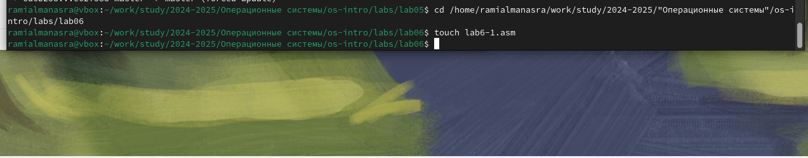{#fig:001 width=70%}

В созданном файле я ввожу программу из листинга (рис. -@fig:002).

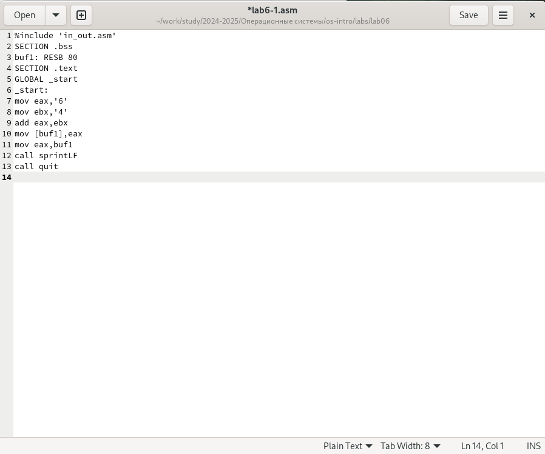{#fig:002 width=70%}

Я создаю исполняемый файл и запускаю его, вывод программы отличается от того, что ожидалось изначально, потому что коды символов вместе дают символ j в соответствии с таблицей ASCII. {#fig:003 width=70%} 

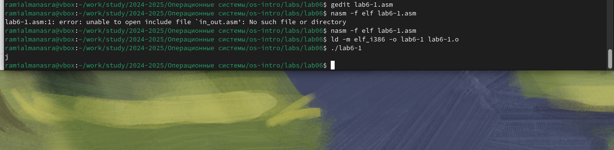{#fig:003 width=70%}

Я изменяю текст исходной программы, убирая кавычки (рис. -@fig:004).

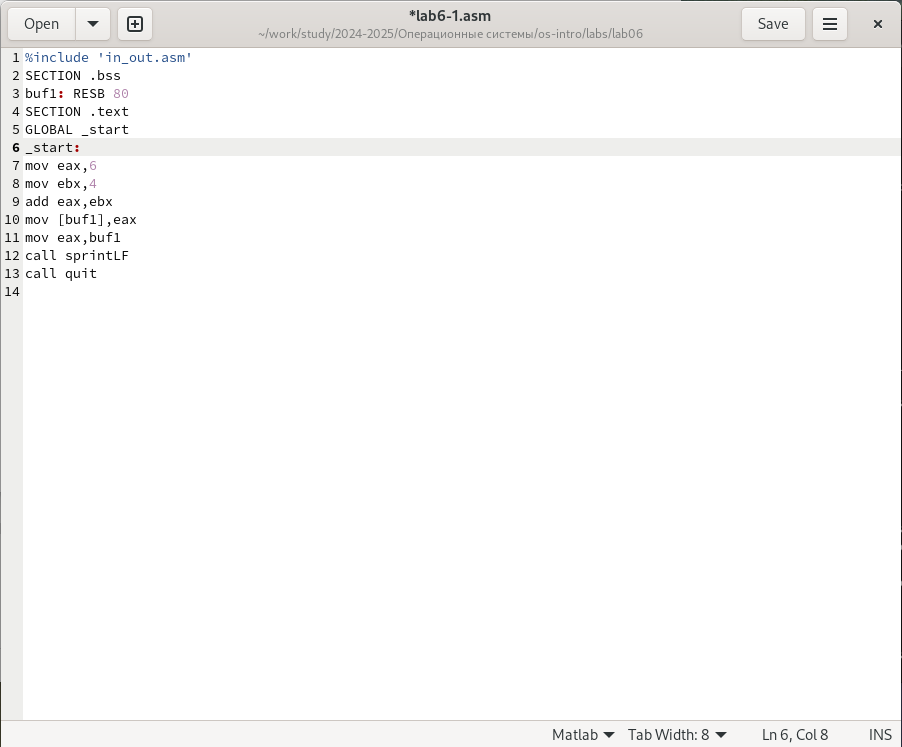{#fig:004 width=70%}

В этот раз программа вернула пустую строку, это связано с тем, что символ 10 означает новую строку. (рис. -@fig:005).

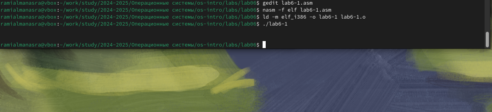{#fig:005 width=70%}

Создаю файл lab6-2.asm в каталоге и ввожу в него текст программы из листинга (рис. -@fig:006).

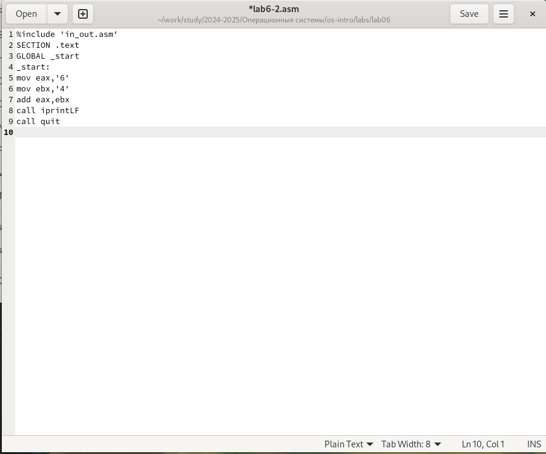{#fig:006 width=70%}

Я создаю исполняемый файл и запускаю его, В результате работы программы мы получим число 106. В данном случае, как и в первом, команда add складывает коды символов ‘6’ и ‘4’ (54+52=106). Однако, в отличии от программы из первого листинга, функция iprintLF позволяет вывести число, а не символ, кодом которого является это число (рис. -@fig:007).

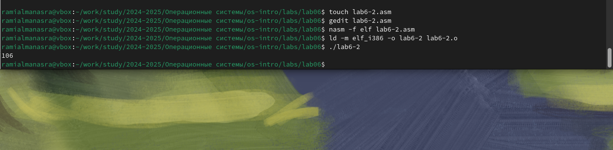{#fig:007 width=70%}

После удаления кавычек в программе я запускаю ее снова и получаю результат, который изначально предполагал. (рис. -@fig:008).

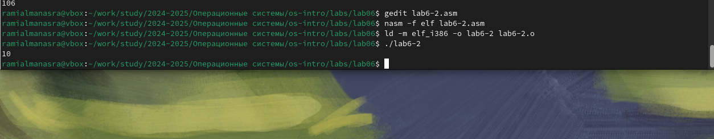{#fig:008 width=70%}

Замена функции вывода на iprint дает мне тот же результат, но в той же строке (рис. -@fig:009).

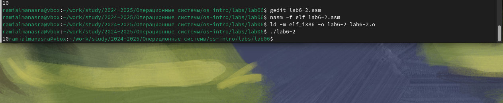{#fig:009 width=70%}

## Выполнение арифметических операций в NASM

Создайте файл lab6-3.asm в каталоге и ввожу текст программы из листинга(рис. -@fig:010).

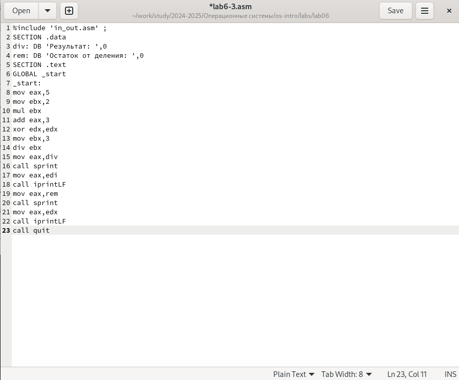{#fig:010 width=70%}

Программа выполняет арифметические вычисления, выводит результирующее выражение и его остаток от деления (рис. -@fig:011).

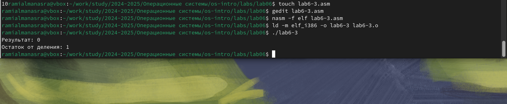{#fig:011 width=70%}

Замена переменных в программе для выражения f(x) = (4*6+2)/5 (рис. -@fig:012).

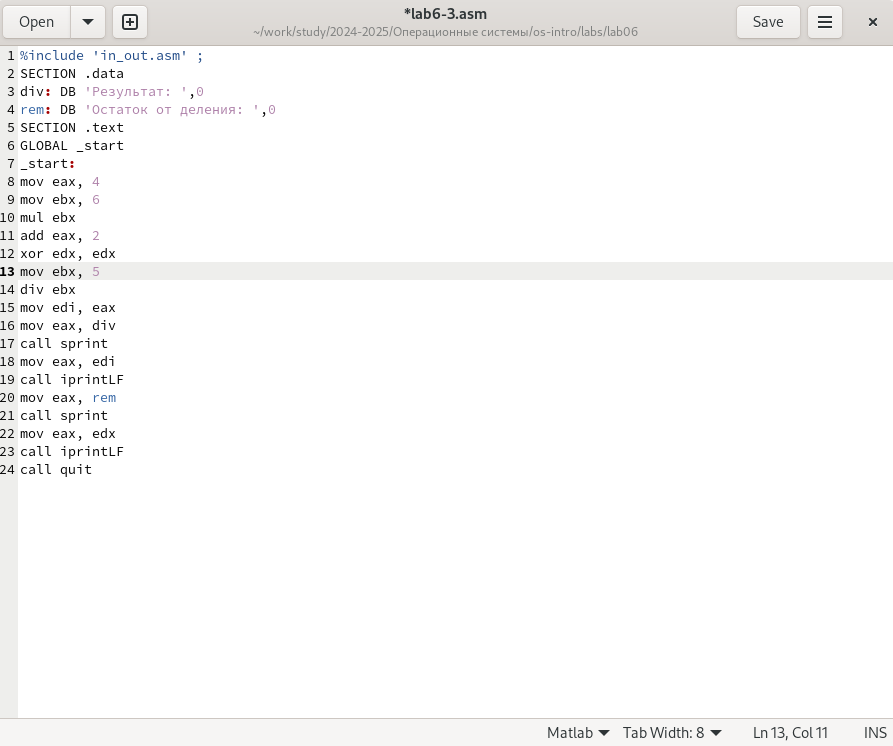{#fig:012 width=70%}

Запуск программы дает правильный результат (рис. -@fig:013).

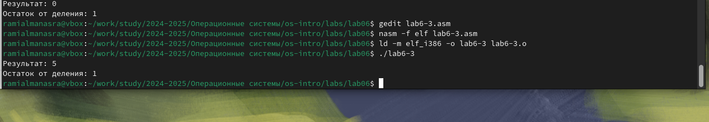{#fig:013 width=70%}

Я создаю новый файл lab6-4 и помещаю текст из листинга (рис. -@fig:014).

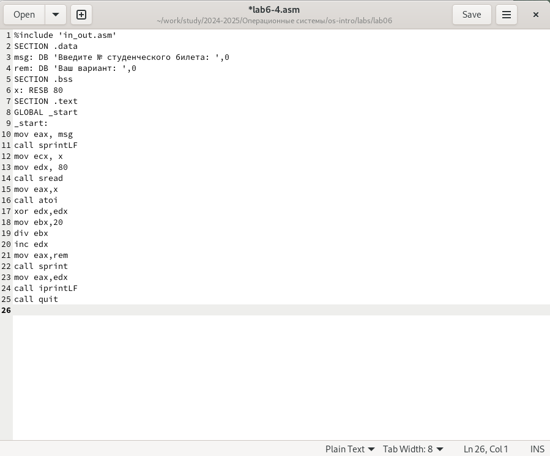{#fig:014 width=70%}

После запуска программы и ввода номера моего студенческого билета я получил свою версию для работы. (рис. -@fig:015).

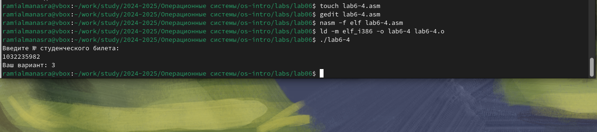{#fig:015 width=70%}

## Answers to security questions

1. Следующие строки кода отвечают за отображение сообщения “Ваш вариант”:

```NASM
mov eax,rem
call sprint
```

2. Команда mov ecx, x используется для ввода адреса входной строки x в регистр ecx. mov edx, 80 - записывает длину входной строки в регистр edx. call sread - вызывает подпрограмму из внешнего файла, которая обеспечивает ввод сообщения с клавиатуры.

3. call atoi используется для вызова подпрограммы из внешнего файла, которая преобразует ascii-код символа в целое число и записывает результат в регистр eax.

4. Строками, ответственными за расчет варианта, являются:

```NASM
xor edx,edx ; reset edx for correct work div
mov ebx,20 ; ebx = 20
div ebx ; eax = eax/20, edx - remainder from division
inc edx ; edx = edx + 1
```

5.Когда выполняется команда div ebx, оставшаяся часть от деления записывается в регистр edx.

6. Команда inc edx увеличивает значение регистра edx на 1.

7. Следующие строки отвечают за отображение результатов вычислений на экране:
```NASM
mov eax,edx
call iprintLF
```

## Задание для самостоятельной работы

В соответствии с выбранным вариантом я реализую программу для вычисления функции f(x) = (2 + x)^2 , проверка по нескольким переменным показывает корректность выполнения программы (рис. -@fig:016), (рис. -@fig:017).

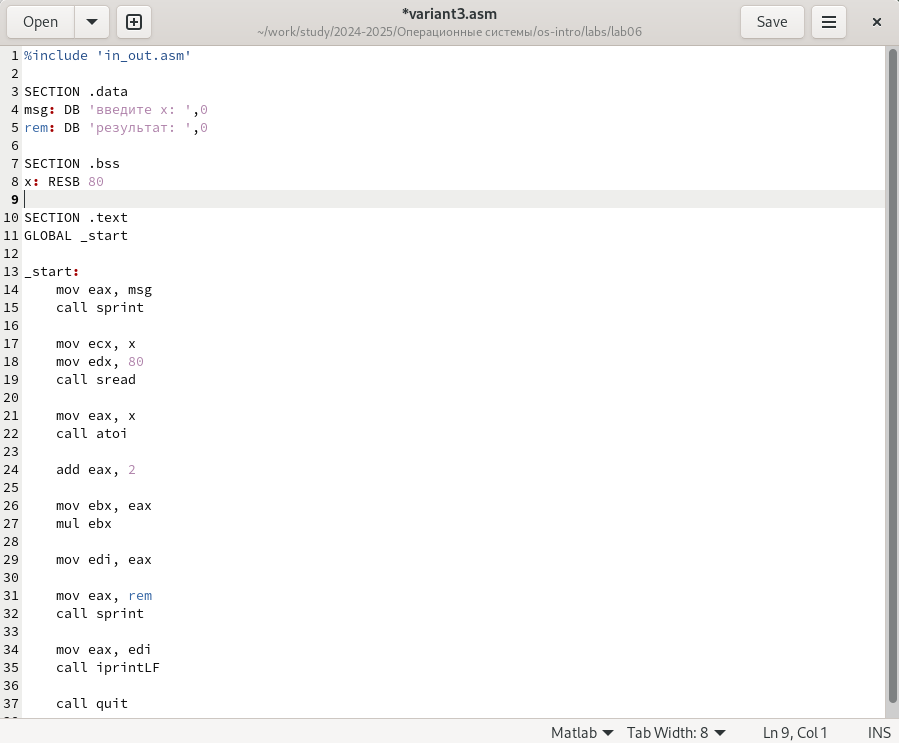{#fig:016 width=70%} 

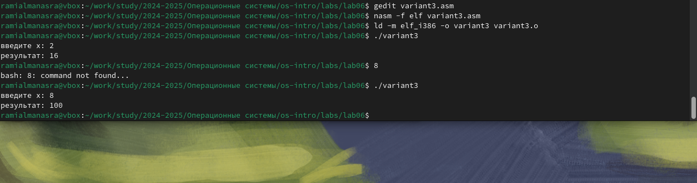{#fig:017 width=70%}

Код программы:

```NASM
%include 'in_out.asm'

SECTION .data
msg: DB 'введите x: ',0
rem: DB 'результат: ',0

SECTION .bss
x: RESB 80

SECTION .text
GLOBAL _start

_start:
    mov eax, msg
    call sprint

    mov ecx, x
    mov edx, 80
    call sread

    mov eax, x
    call atoi  

    add eax, 2 

    mov ebx, eax
    mul ebx  

    mov edi, eax

    mov eax, rem
    call sprint

    mov eax, edi
    call iprintLF

    call quit
```

# Выводы

Во время этой лабораторной работы я освоил арифметические инструкции языка ассемблера NASM.

# Список литературы

1. [Пример выполнения лабораторной работы](https://github.com/evdvorkina/study_2022-2023_arh-pc/blob/master/labs/lab07/report/%D0%9B07_%D0%94%D0%B2%D0%BE%D1%80%D0%BA%D0%B8%D0%BD%D0%B0_%D0%BE%D1%82%D1%87%D0%B5%D1%82.pdf)
2. [Курс на ТУИС](https://esystem.rudn.ru/course/view.php?id=112)
3. [Лабораторная работа №6](https://esystem.rudn.ru/pluginfile.php/2089086/mod_resource/content/0/%D0%9B%D0%B0%D0%B1%D0%BE%D1%80%D0%B0%D1%82%D0%BE%D1%80%D0%BD%D0%B0%D1%8F%20%D1%80%D0%B0%D0%B1%D0%BE%D1%82%D0%B0%20%E2%84%966.%20%D0%90%D1%80%D0%B8%D1%84%D0%BC%D0%B5%D1%82%D0%B8%D1%87%D0%B5%D1%81%D0%BA%D0%B8%D0%B5%20%D0%BE%D0%BF%D0%B5%D1%80%D0%B0%D1%86%D0%B8%D0%B8%20%D0%B2%20NASM.pdf)
4. [Программирование на языке ассемблера NASM Столяров А. В.](https://esystem.rudn.ru/pluginfile.php/2088953/mod_resource/content/2/%D0%A1%D1%82%D0%BE%D0%BB%D1%8F%D1%80%D0%BE%D0%B2%20%D0%90.%20%D0%92.%20-%20%D0%9F%D1%80%D0%BE%D0%B3%D1%80%D0%B0%D0%BC%D0%BC%D0%B8%D1%80%D0%BE%D0%B2%D0%B0%D0%BD%D0%B8%D0%B5%20%D0%BD%D0%B0%20%D1%8F%D0%B7%D1%8B%D0%BA%D0%B5%20%D0%B0%D1%81%D1%81%D0%B5%D0%BC%D0%B1%D0%BB%D0%B5%D1%80%D0%B0%20NASM%20%D0%B4%D0%BB%D1%8F%20%D0%9E%D0%A1%20Unix.pdf)
