---
## Front matter
title: "Лабораторная работа №7"
subtitle: "Архитектура ЭВМ"
author: "Альманасра Рами"

## Generic otions
lang: ren-EN
toc-title: "Content"

## Bibliography
bibliography: bib/cite.bib
csl: pandoc/csl/gost-r-7-0-5-2008-numeric.csl

## Pdf output format
toc: true # Table of contents
toc-depth: 2
lof: true # List of figures
lot: true # List of tables
fontsize: 12pt
linestretch: 1.5
papersize: a4
documentclass: scrreprt
## I18n polyglossia
polyglossia-lang:
  name: russian
  options:
	- spelling=modern
	- babelshorthands=true
polyglossia-otherlangs:
  name: english
## I18n babel
babel-lang: russian
babel-otherlangs: english
## Fonts
mainfont: IBM Plex Serif
romanfont: IBM Plex Serif
sansfont: IBM Plex Sans
monofont: IBM Plex Mono
mathfont: STIX Two Math
mainfontoptions: Ligatures=Common,Ligatures=TeX,Scale=0.94
romanfontoptions: Ligatures=Common,Ligatures=TeX,Scale=0.94
sansfontoptions: Ligatures=Common,Ligatures=TeX,Scale=MatchLowercase,Scale=0.94
monofontoptions: Scale=MatchLowercase,Scale=0.94,FakeStretch=0.9
mathfontoptions:
## Biblatex
biblatex: true
biblio-style: "gost-numeric"
biblatexoptions:
  - parentracker=true
  - backend=biber
  - hyperref=auto
  - language=auto
  - autolang=other*
  - citestyle=gost-numeric
## Pandoc-crossref LaTeX customization
figureTitle: "Fig."
tableTitle: "Table"
listingTitle: "Listing"
lofTitle: "List of illustrations"
lotTitle: "List of Tables"
lolTitle: "Listings"
## Misc options
indent: true
header-includes:
  - \usepackage{indentfirst}
  - \usepackage{float} # keep figures where there are in the text
  - \floatplacement{figure}{H} # keep figures where there are in the text
---


**Цель работы**

Изучение команд условного и безусловного переходов. Приобретение навыков написания программ с использованием переходов. Знакомство с назначением и структурой файла листинга.

**Задание**

1. Реализация переходов в NASM
2. Изучение структуры файлов листинга
3. Самостоятельное написание программ на основе материалов лабораторной работы

**Теоретическое введение**

Для реализации ветвлений в ассемблере используются так называемые команды передачи управления или команды перехода. Можно выделить 2 типа переходов:
• условный переход – выполнение или не выполнение перехода в определенную точку программы в зависимости от проверки условия.
• безусловный переход – выполнение передачи управления в определенную точку программы без каких-либо условий.

**Выполнение лабораторной работы**

**Реализация переходов в NASM**

Создаю файл lab7-1 (Fig. -@fig:001).

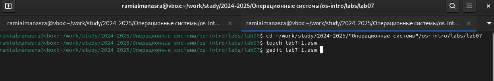{#fig:001 width=70%}

Я копирую код из листинга в файл. (Fig. -@fig:002).

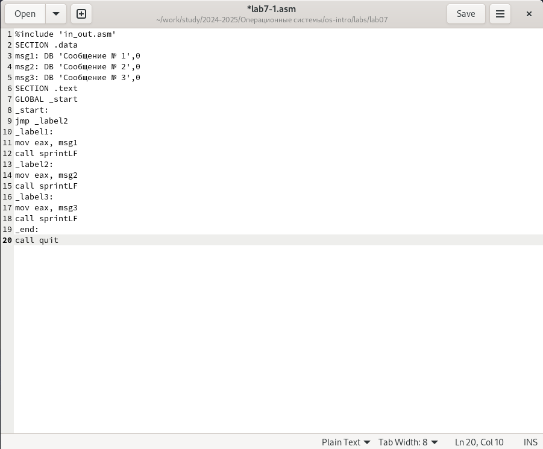{#fig:002 width=70%}

При запуске программы я убедился, что безусловный переход действительно меняет порядок выполнения инструкций (Fig. -@fig:003).

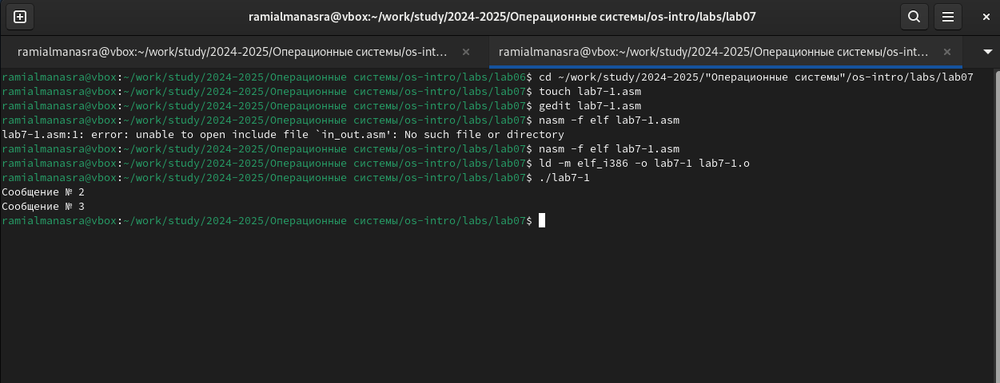{#fig:003 width=70%}

Я меняю программу таким образом, что меняется порядок выполнения функций (Fig. -@fig:004).

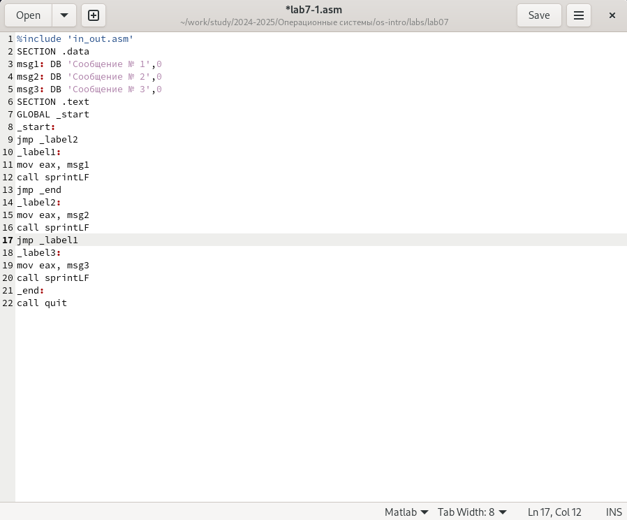{#fig:004 width=70%}

запускаю программу и проверяю правильность внесенных изменений (Fig. -@fig:005).

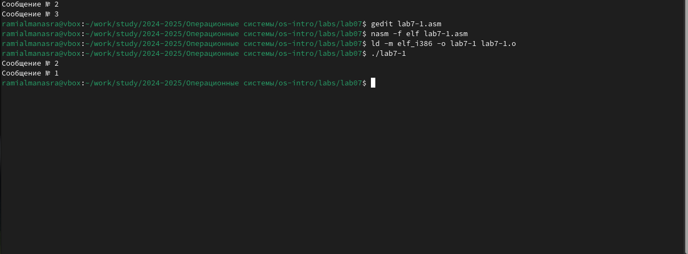{#fig:005 width=70%}

Теперь изменяю текст программы так, чтобы все три сообщения отображались в обратном порядке (Fig. -@fig:006).

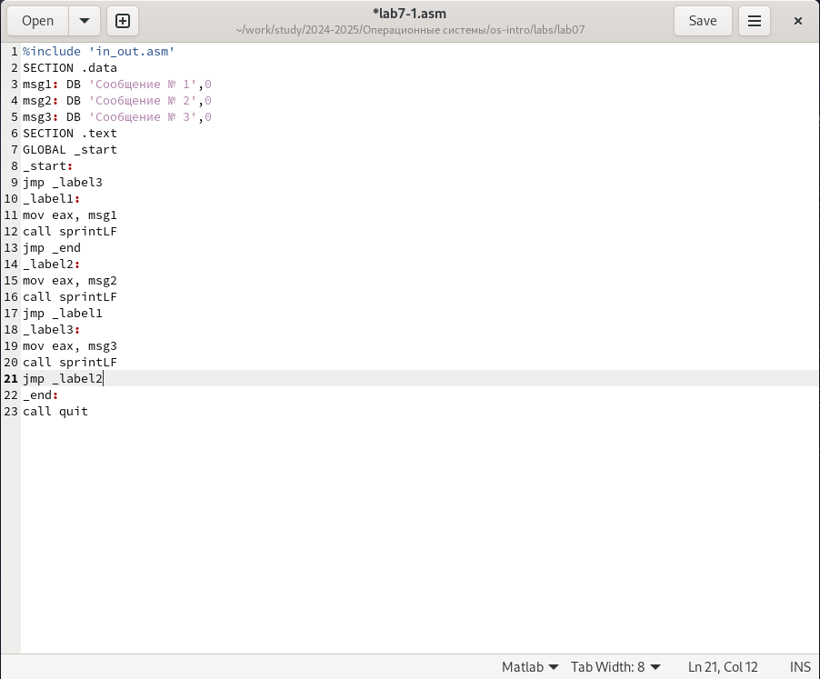{#fig:006 width=70%}

Программа отображает сообщения в нужном мне порядке (Fig. -@fig:007).

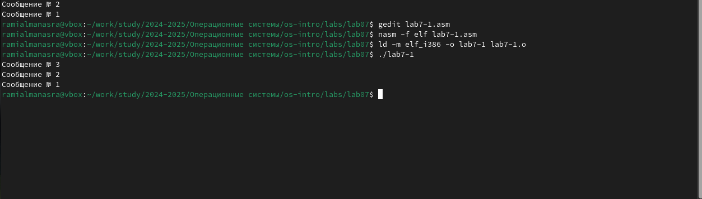{#fig:007 width=70%}

Я создаю новый файл и вставляю в него код из следующего листинга (Fig. -@fig:008).

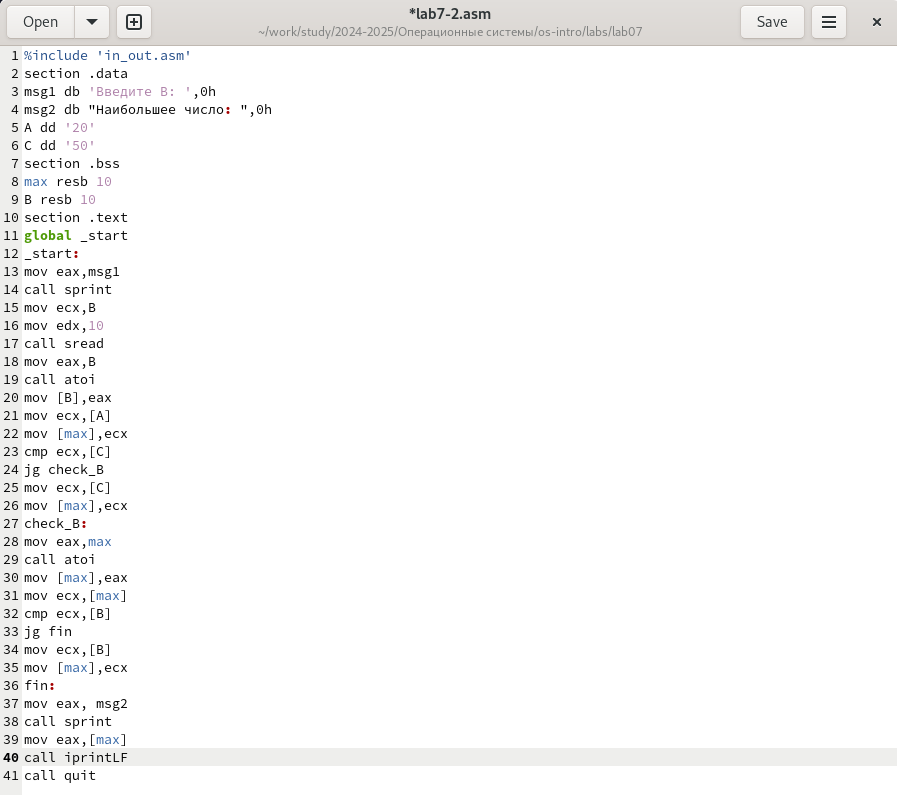{#fig:008 width=70%}

Программа выводит значение переменной с максимальным значением, проверяю работу программы с разными входными данными (Fig. -@fig:009).

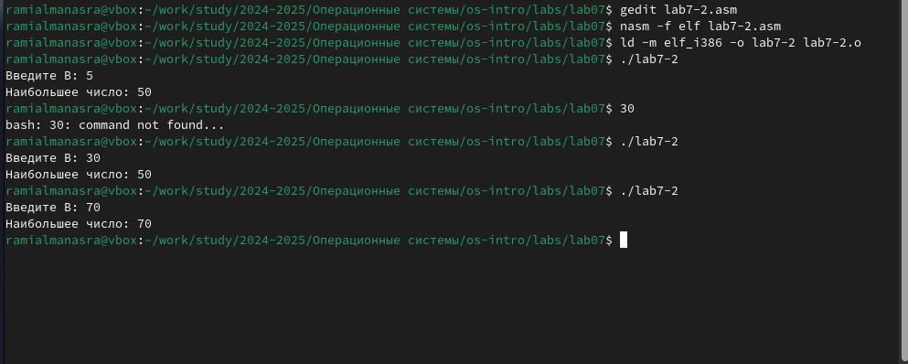{#fig:009 width=70%}

#Изучение структуры файлы листинга

Создаю файл листинга для программы из файла lab7-2.asm указав ключ -l и открываю его с помощью gedit (Fig. -@fig:010).

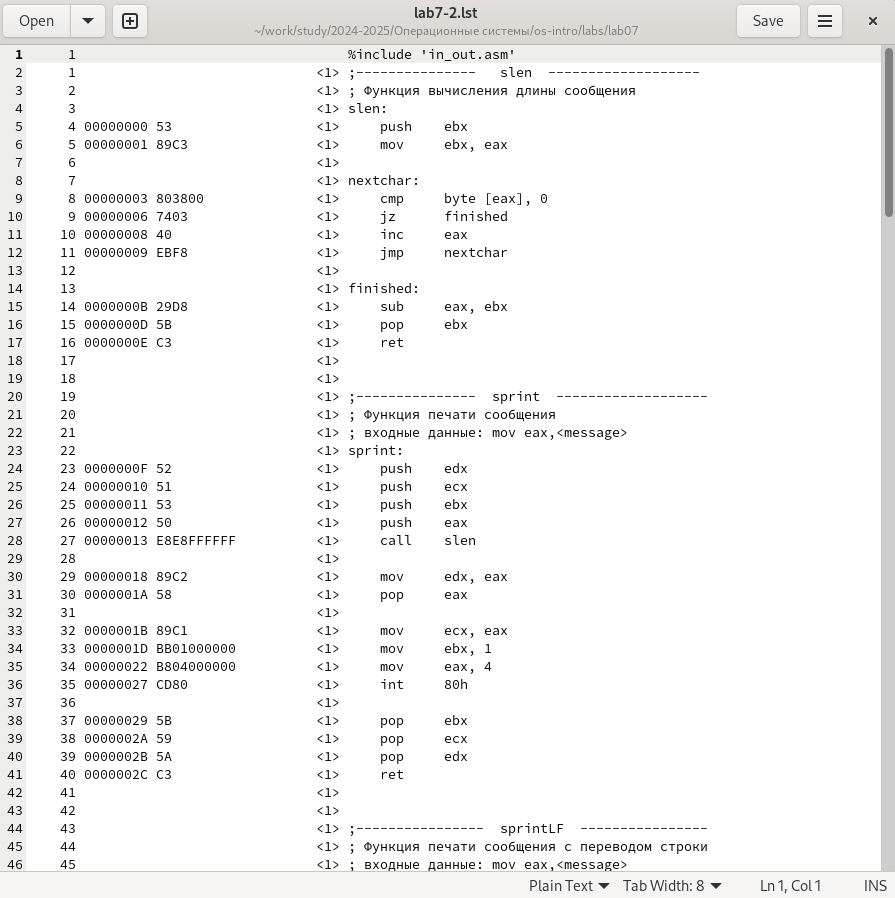{#fig:010 width=70%}

Первое значение в файле-листинге - это номер строки, и он может не совпадать с номером строки исходного файла. Второе вхождение - это адрес, смещение машинного кода относительно начала текущего сегмента, далее идет непосредственно сам машинный код, а строка завершается исходным текстом программы с комментариями.

Я удаляю один операнд из случайной инструкции, чтобы проверить поведение файла листинга (Fig. -@fig:011).

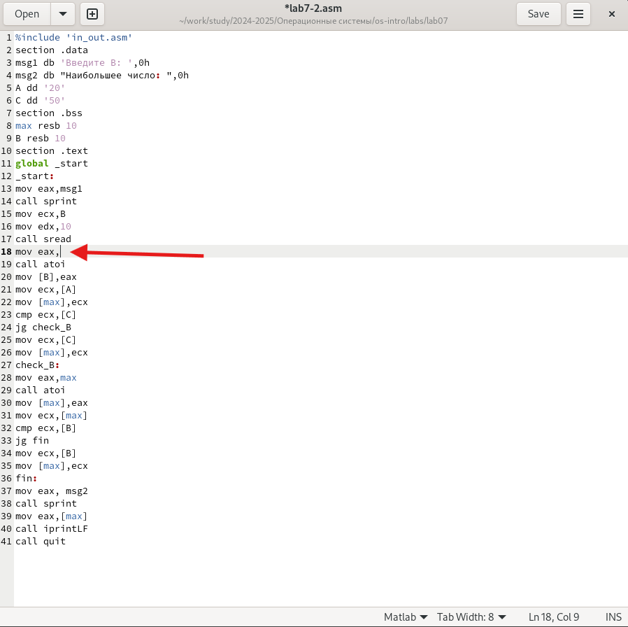{#fig:011 width=70%}

В новом файле листинга отображается ошибка error: invalid combination of opcode and operands. (Fig. -@fig:012).

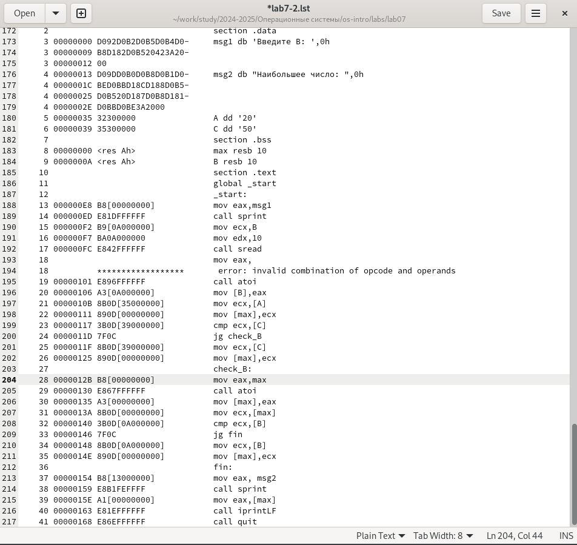{#fig:012 width=70%}

**Задание для самостоятельной работы**

Программа нахождения наименьшей из 3 целочисленных переменных:


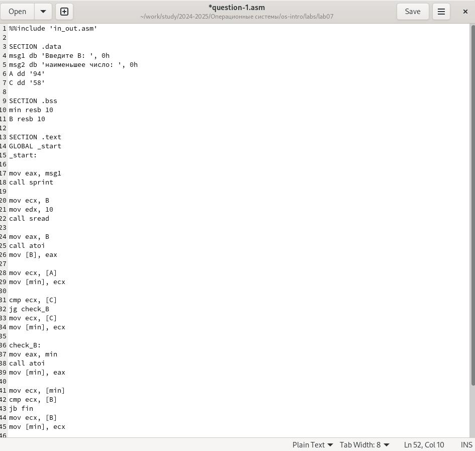{#fig:013 width=70%}

```NASM
%%include 'in_out.asm'

SECTION .data
msg1 db 'Введите B: ', 0h
msg2 db 'наименьшее число: ', 0h
A dd '94'
C dd '58'

SECTION .bss
min resb 10
B resb 10

SECTION .text
GLOBAL _start
_start:

mov eax, msg1
call sprint

mov ecx, B
mov edx, 10
call sread

mov eax, B
call atoi
mov [B], eax

mov ecx, [A]
mov [min], ecx

cmp ecx, [C]
jg check_B
mov ecx, [C]
mov [min], ecx

check_B:
mov eax, min
call atoi
mov [min], eax

mov ecx, [min]
cmp ecx, [B]
jb fin
mov ecx, [B]
mov [min], ecx

fin:
mov eax, msg2
call sprint
mov eax, [min]
call iprintLF
call quit
```

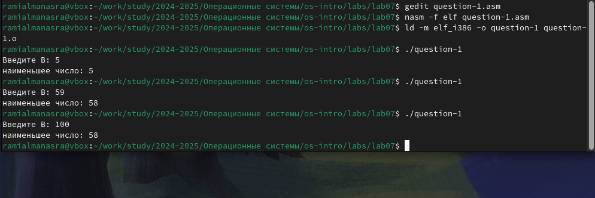{#fig:014 width=70%}

пишу программу, которая будет вычислять значение заданной функции в соответствии с моим вариантом для переменных a и x, введенных с клавиатуры (Fig. -@fig:015).

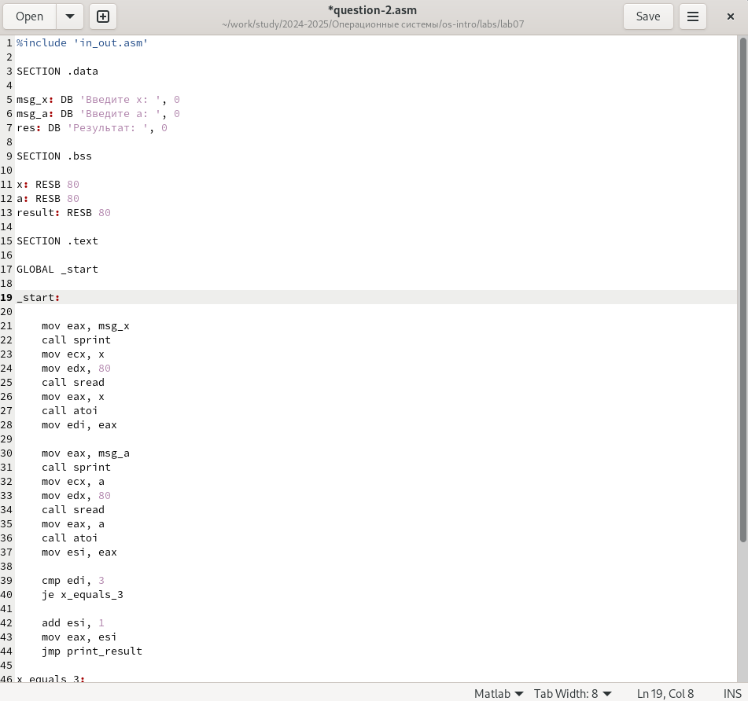{#fig:015 width=70%}

код задания:

```NASM
%include 'in_out.asm'

SECTION .data

msg_x: DB 'Введите x: ', 0
msg_a: DB 'Введите a: ', 0
res: DB 'Результат: ', 0

SECTION .bss

x: RESB 80
a: RESB 80
result: RESB 80

SECTION .text

GLOBAL _start

_start:

    mov eax, msg_x
    call sprint
    mov ecx, x
    mov edx, 80
    call sread
    mov eax, x
    call atoi
    mov edi, eax 

    mov eax, msg_a
    call sprint
    mov ecx, a
    mov edx, 80
    call sread
    mov eax, a
    call atoi
    mov esi, eax 

    cmp edi, 3
    je x_equals_3

    add esi, 1
    mov eax, esi
    jmp print_result

x_equals_3:
    mov eax, edi
    mov ebx, 3
    imul eax, ebx

print_result:
    mov ebx, eax
    mov eax, res
    call sprint
    mov eax, ebx
    call iprintLF

    call quit

```

Проверяю прошрамму (Fig. -@fig:016).

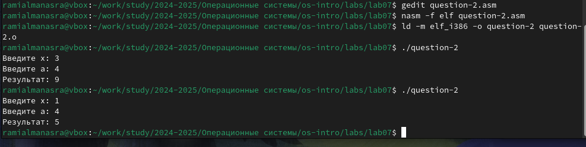{#fig:016 width=70%}

**Выводы**

Во время лабораторной работы я изучил команды условных и безусловных переходов, а также приобрел навыки написания программ с использованием переходов, познакомился с назначением и структурой файлов листинга.

**Список литературы**

1. [Course at RUDN University](https://esystem.rudn.ru/course/view.php?id=112)
2. [Laboratory work No. 7](https://esystem.rudn.ru/pluginfile.php/2089087/mod_resource/content/0/%D0%9B%D0%B0%D0%B1%D0%BE%D1%80%D0%B0%D1%82%D0%BE%D1%80%D0%BD%D0%B0%D1%8F%20%D1%80%D0%B0%D0%B1%D0%BE%D1%82%D0%B0%20%E2%84%967.%20%D0%9A%D0%BE%D0%BC%D0%B0%D0%BD%D0%B4%D1%8B%20%D0%B1%D0%B5%D0%B7%D1%83%D1%81%D0%BB%D0%BE%D0%B2%D0%BD%D0%BE%D0%B3%D0%BE%20%D0%B8%20%D1%83%D1%81%D0%BB%D0%BE%D0%B2%D0%BD%D0%BE%D0%B3%D0%BE%20%D0%BF%D0%B5%D1%80%D0%B5%D1%85%D0%BE%D0%B4%D0%BE%D0%B2%20%D0%B2%20Nasm.%20%D0%9F%D1%80%D0%BE%D0%B3%D1%80%D0%B0%D0%BC%D0%BC%D0%B8%D1%80%D0%BE%D0%B2%D0%B0%D0%BD%D0%B8%D0%B5%20%D0%B2%D0%B5%D1%82%D0%B2%D0%BB%D0%B5%D0%BD%D0%B8%D0%B9.pdf)
3. [Programming in NASM assembler language by Stolyarov A. V.](https://esystem.rudn.ru/pluginfile.php/2088953/mod_resource/content/2/%D0%A1%D1%82%D0%BE%D0%BB%D1%8F%D1%80%D0%BE%D0%B2%20%D0%90.%20%D0%92.%20-%20%D0%9F%D1%80%D0%BE%D0%B3%D1%80%D0%B0%D0%BC%D0%BC%D0%B8%D1%80%D0%BE%D0%B2%D0%B0%D0%BD%D0%B8%D0%B5%20%D0%BD%D0%B0%20%D1%8F%D0%B7%D1%8B%D0%BA%D0%B5%20%D0%B0%D1%81%D1%81%D0%B5%D0%BC%D0%B1%D0%BB%D0%B5%D1%80%D0%B0%20NASM%20%D0%B4%D0%BB%D1%8F%20%D0%9E%D0%A1%20Unix.pdf)
