---
## Front matter
title: "Лабораторная работа №8"
subtitle: "Архитектура ЭВМ"
author: "Альманасра Рами"

## Generic otions
lang: ren-EN
toc-title: "Content"

## Bibliography
bibliography: bib/cite.bib
csl: pandoc/csl/gost-r-7-0-5-2008-numeric.csl

## Pdf output format
toc: true # Table of contents
toc-depth: 2
lof: true # List of figures
lot: true # List of tables
fontsize: 12pt
linestretch: 1.5
papersize: a4
documentclass: scrreprt
## I18n polyglossia
polyglossia-lang:
  name: russian
  options:
	- spelling=modern
	- babelshorthands=true
polyglossia-otherlangs:
  name: english
## I18n babel
babel-lang: russian
babel-otherlangs: english
## Fonts
mainfont: IBM Plex Serif
romanfont: IBM Plex Serif
sansfont: IBM Plex Sans
monofont: IBM Plex Mono
mathfont: STIX Two Math
mainfontoptions: Ligatures=Common,Ligatures=TeX,Scale=0.94
romanfontoptions: Ligatures=Common,Ligatures=TeX,Scale=0.94
sansfontoptions: Ligatures=Common,Ligatures=TeX,Scale=MatchLowercase,Scale=0.94
monofontoptions: Scale=MatchLowercase,Scale=0.94,FakeStretch=0.9
mathfontoptions:
## Biblatex
biblatex: true
biblio-style: "gost-numeric"
biblatexoptions:
  - parentracker=true
  - backend=biber
  - hyperref=auto
  - language=auto
  - autolang=other*
  - citestyle=gost-numeric
## Pandoc-crossref LaTeX customization
figureTitle: "Fig."
tableTitle: "Table"
listingTitle: "Listing"
lofTitle: "List of illustrations"
lotTitle: "List of Tables"
lolTitle: "Listings"
## Misc options
indent: true
header-includes:
  - \usepackage{indentfirst}
  - \usepackage{float} # keep figures where there are in the text
  - \floatplacement{figure}{H} # keep figures where there are in the text
---

# Цель работы

Приобретение навыков написания программ с использованием циклов и обработкой аргументов командной строки.

# Задание

1. Реализация цикла в NASM

2. Обработка аргументов командной строки

3. Самостоятельное написание программы по материалам лабораторной работы
   
# Теоретическое введение

Стек — это структура данных, организованная по принципу LIFO («Last In — First Out» или «последним пришёл — первым ушёл»). Стек является частью архитектуры процессора и реализован на аппаратном уровне. Для работы со стеком в процессоре есть специальные регистры (ss, bp, sp) и команды.

Основной функцией стека является функция сохранения адресов возврата и передачи аргументов при вызове процедур. Кроме того, в нём выделяется память для локальных переменных и могут временно храниться значения регистров.

# Выполнение лабораторной работы

## Реализация циклов в NASM

Создаю файл lab8-1.asm в каталог для программам лабораторной работы № 8 (Fig. -@fig:001).

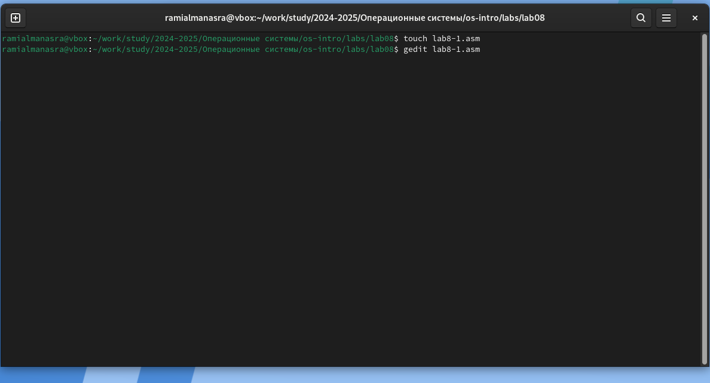{#fig:001 width=70%}

Копирую программу из листинга в созданный файл (Fig. -@fig:002).

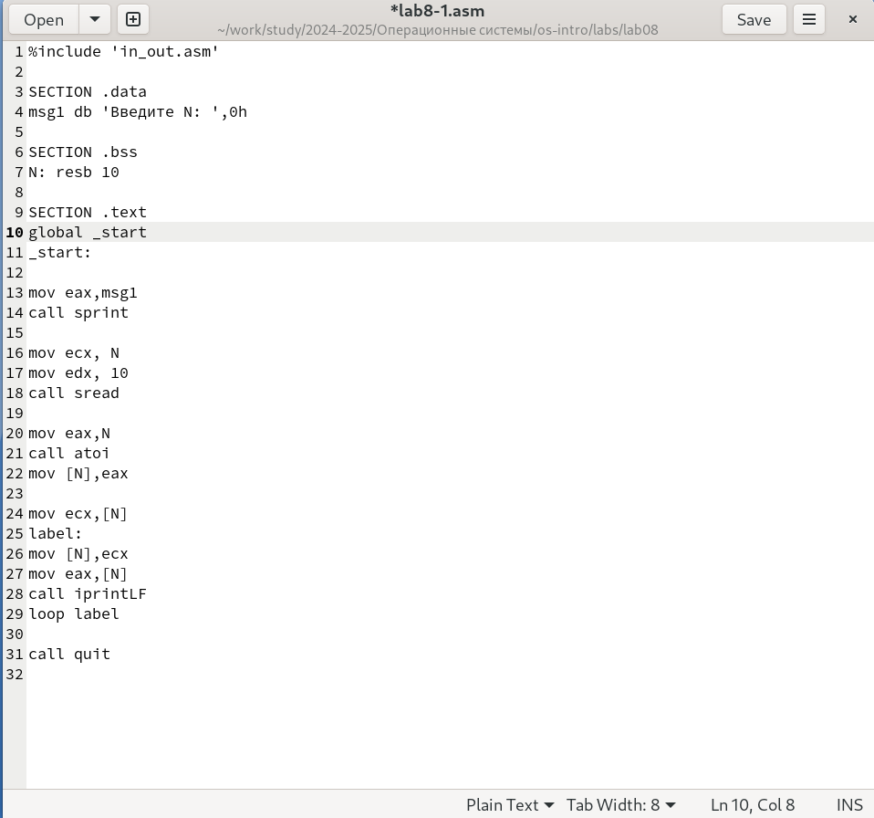{#fig:002 width=70%}

Я запускаю программу; она показывает работу циклов в NASM (Fig. -@fig:003).

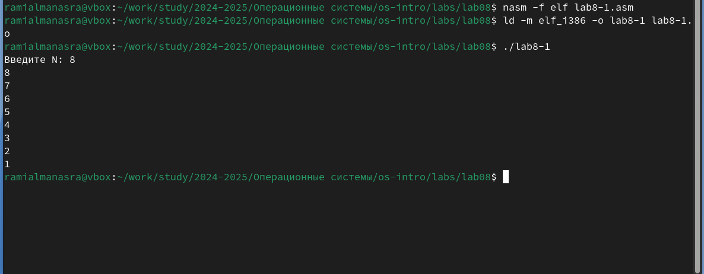{#fig:003 width=70%}

Изменяю текст программы добавив изменение значение регистра ecx в цикле (Fig. -@fig:004).

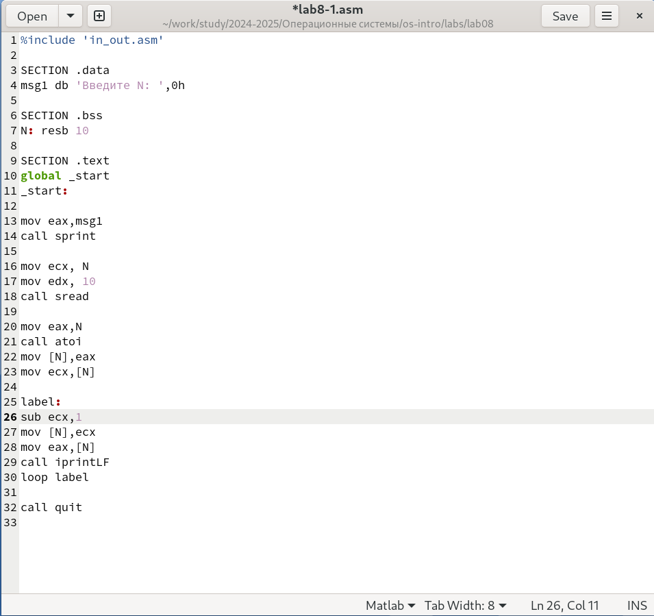{#fig:004 width=70%}

Из-за того, что теперь значения регистр ecx уменьшается на каждой итерации на 2 , количество итераций сокращается вдвое (Fig. -@fig:005).

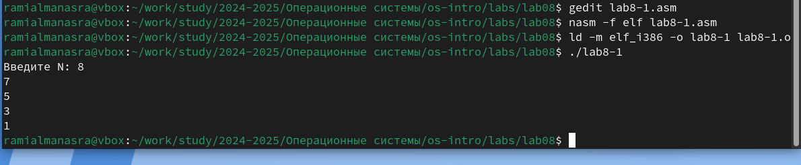{#fig:005 width=70%}

Вношу изменения в текст программы добавив команды push и pop (добавления в стек и извлечения из стека) (Fig. -@fig:006).

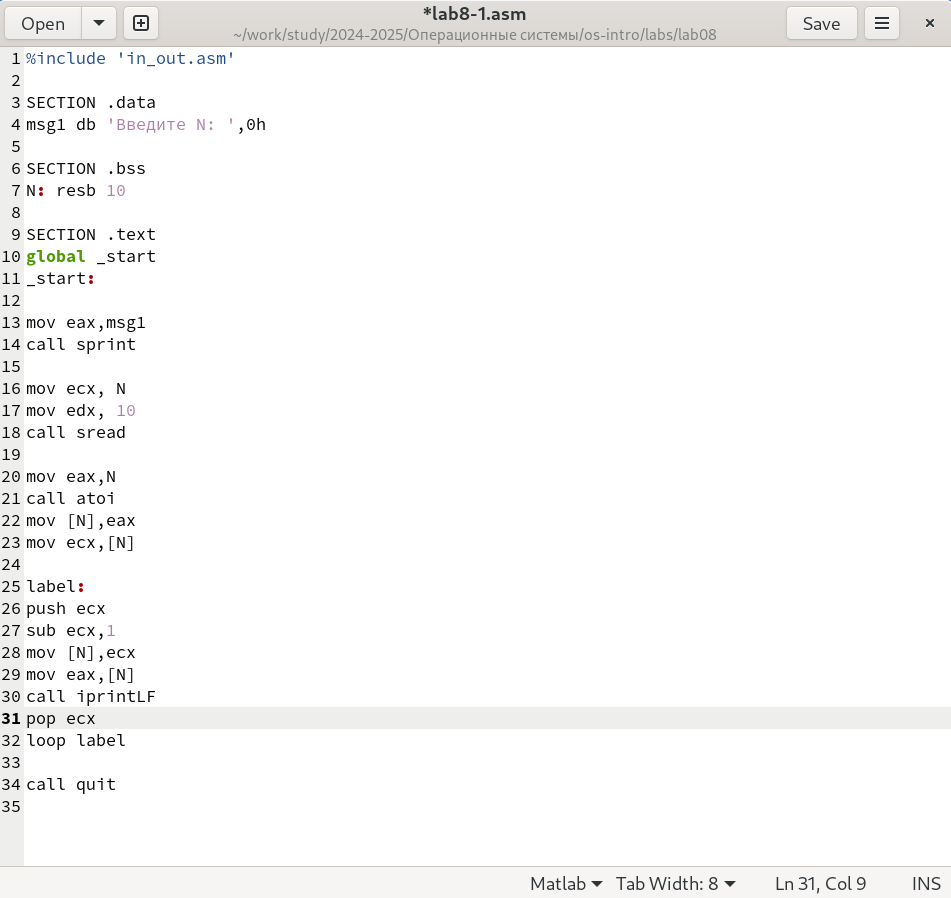{#fig:006 width=70%}

Теперь количество итераций соответствует введенному N, но выводные числа изменились на -1 (Fig. -@fig:007).

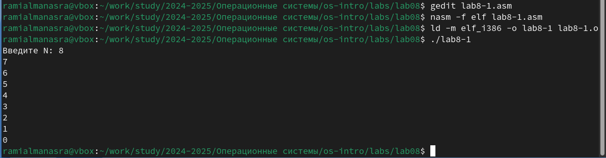{#fig:007 width=70%}

## Обработка аргументов командной строки

Создаю файл lab8-2.asm в каталоге и ввожу в него текст программы из листинга  (Fig. -@fig:008).

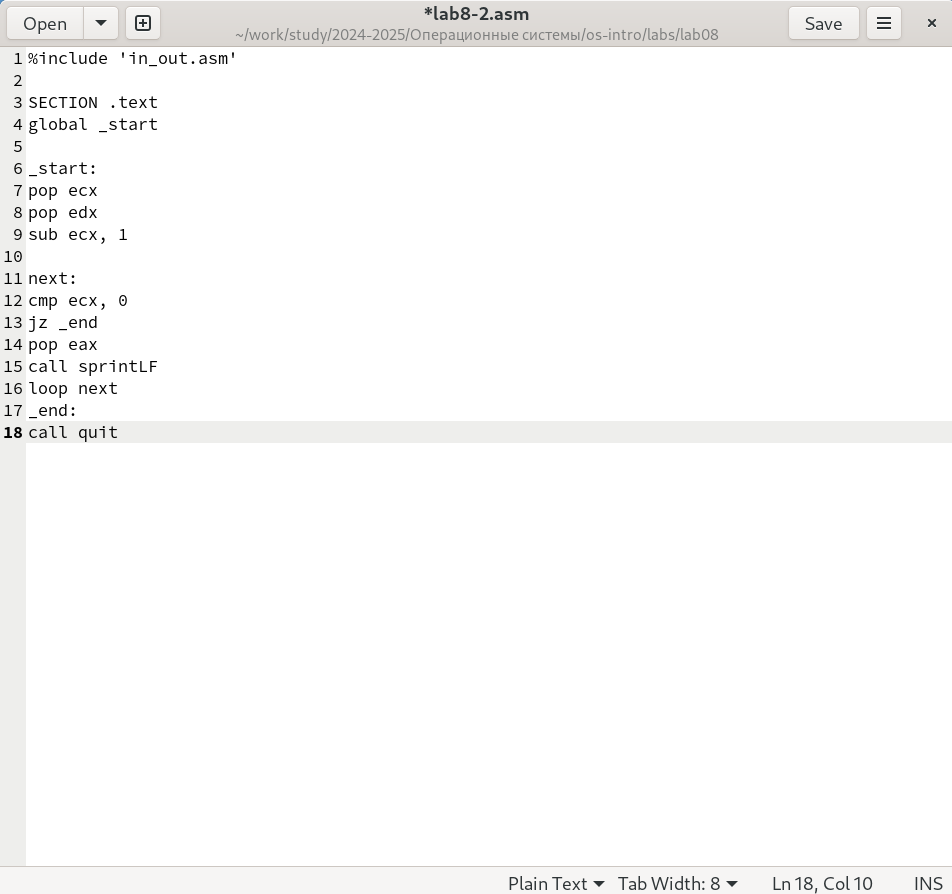{#fig:008 width=70%}

Я скомпилировал программу и запустил ее, указав аргументы. Программа обработала то же количество аргументов, что и было введено (Fig. -@fig:009).

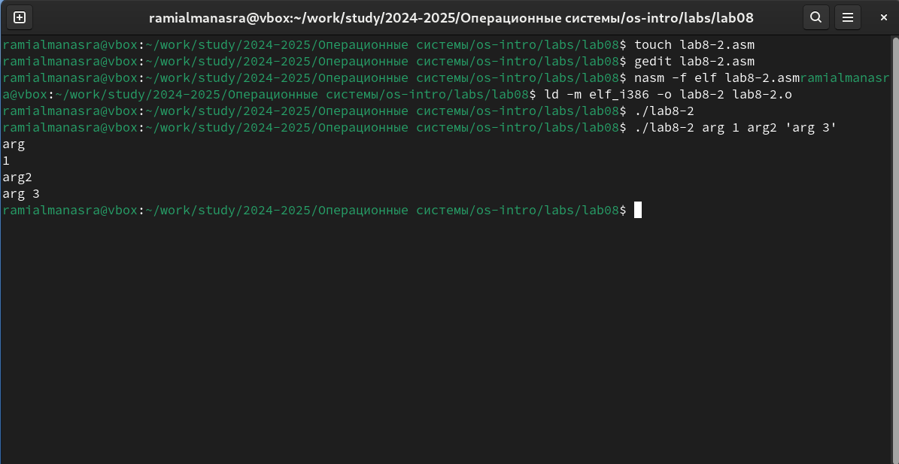{#fig:009 width=70%}

Создаю новый файл для программы и копирую в него код из третьего листинга (Fig. -@fig:010).

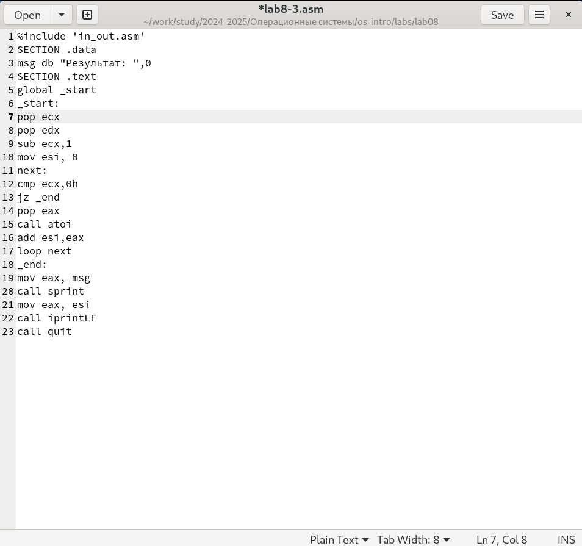{#fig:010 width=70%}

Я компилирую программу и запускаю ее, указывая некоторые числа в качестве аргументов, программа суммирует их (Fig. -@fig:011).

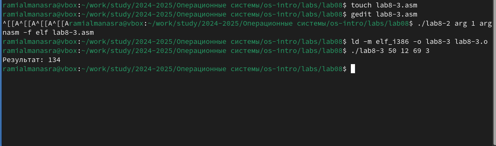{#fig:011 width=70%}

Изменяю текст программы из листинга для вычисления произведения аргументов командной строки (Fig. -@fig:012).

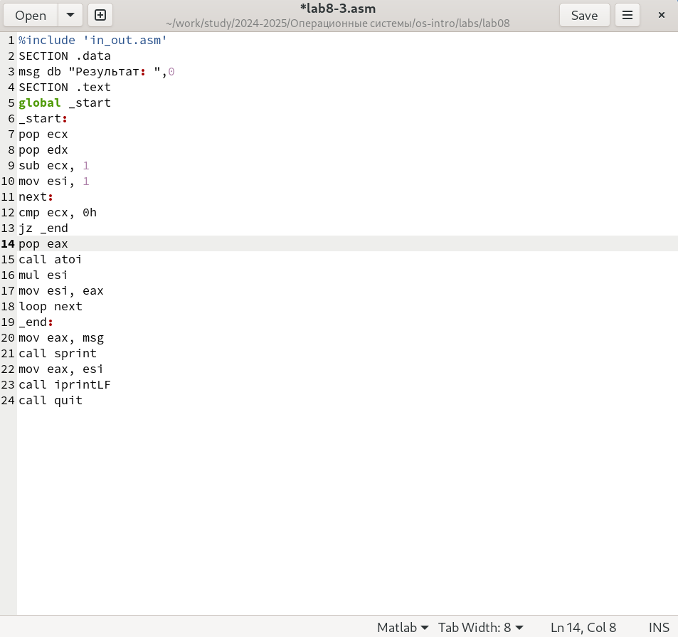{#fig:012 width=70%}

Теперь программа умножает введенные числа (Fig. -@fig:013).

{#fig:013 width=70%}

##  Задание для самостоятельной работы

Я пишу программу, которая найдет сумму значений для функции f(x) = 10x-5, которая соответствует моему третьему варианту (Fig. -@fig:014).

{#fig:014 width=70%}

код программы:

```NASM

%include 'in_out.asm'

SECTION .data

msg_result db "Результат: ", 0
sum dd 0  

SECTION .text

GLOBAL _start

_start:
    pop ecx
    pop edx
    sub ecx, 1

next:
    cmp ecx, 0h
    jz _end

    pop eax
    call atoi

    mov ebx, 10
    mul ebx

    sub eax, 5

    add [sum], eax

    loop next

_end:
    mov eax, msg_result
    call sprint
    mov eax, [sum]
    call iprintLF

    call quit

```

Проверяю работу программы, указывая в качестве аргументов несколько чисел (Fig. -@fig:015).

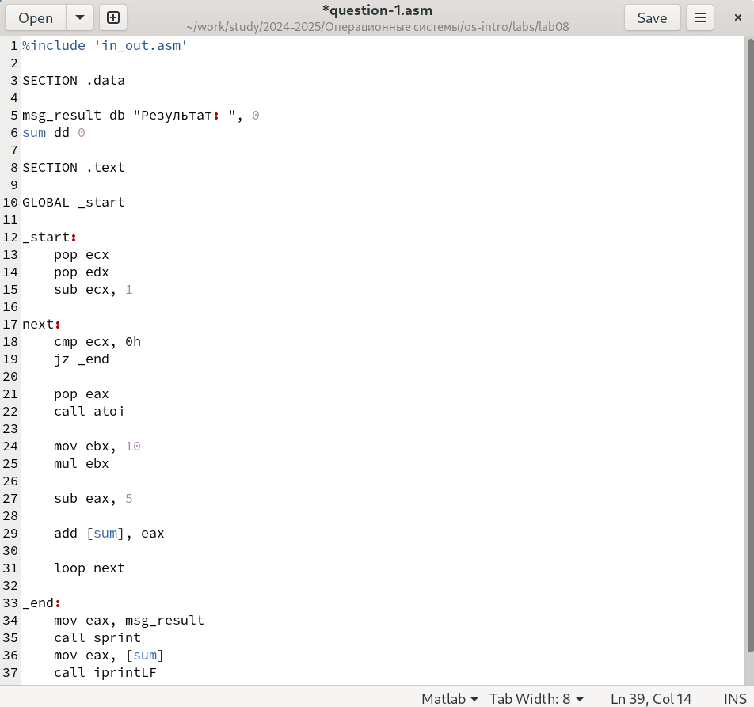{#fig:015 width=70%}

# Выводы

В результате этой лабораторной работы я приобрел навыки написания программ с использованием циклов, а также научился обрабатывать аргументы командной строки.

# Список литературы

1. [Course on TUIS](https://esystem.rudn.ru/course/view.php?id=112)

2. [Laboratory Work No. 8](https://esystem.rudn.ru/pluginfile.php/2089095/mod_resource/content/0/%D0%9B%D0%B0%D0%B1%D0%BE%D1%80%D0%B0%D1%82%D0%BE%D1%80%D0%BD%D0%B0%D1%8F%20%D1%80%D0%B0%D0%B1%D0%BE%D1%82%D0%B0%20%E2%84%968.%20%D0%9F%D1%80%D0%BE%D0%B3%D1%80%D0%B0%D0%BC%D0%BC%D0%B8%D1%80%D0%BE%D0%B2%D0%B0%D0%BD%D0%B8%D0%B5%20%D1%86%D0%B8%D0%BA%D0%BB%D0%B0.%20%D0%9E%D0%B1%D1%80%D0%B0%D0%B1%D0%BE%D1%82%D0%BA%D0%B0%20%D0%B0%D1%80%D0%B3%D1%83%D0%BC%D0%B5%D0%BD%D1%82%D0%BE%D0%B2%20%D0%BA%D0%BE%D0%BC%D0%B0%D0%BD%D0%B4%D0%BD%D0%BE%D0%B9%20%D1%81%D1%82%D1%80%D0%BE%D0%BA%D0%B8.pdf)

3. [Programming in NASM Assembler Language, Stolyarov A. V.](https://esystem.rudn.ru/pluginfile.php/2088953/mod_resource/content/2/%D0%A1%D1%82%D0%BE%D0%BB%D1%8F%D1%80%D0%BE%D0%B2%20%D0%90.%20%D0%92.%20-%20%D0%9F%D1%80%D0%BE%D0%B3%D1%80%D0%B0%D0%BC%D0%BC%D0%B8%D1%80%D0%BE%D0%B2%D0%B0%D0%BD%D0%B8%D0%B5%20%D0%BD%D0%B0%20%D1%8F%D0%B7%D1%8B%D0%BA%D0%B5%20%D0%B0%D1%81%D1%81%D0%B5%D0%BC%D0%B1%D0%BB%D0%B5%D1%80%D0%B0%20NASM%20%D0%B4%D0%BB%D1%8F%20%D0%9E%D0%A1%20Unix.pdf)

 
