---
## Front matter
title: "Лабораторная работа №9"
subtitle: "Архитектура ЭВМ"
author: "Альманасра Рами"

## Generic otions
lang: ren-EN
toc-title: "Content"

## Bibliography
bibliography: bib/cite.bib
csl: pandoc/csl/gost-r-7-0-5-2008-numeric.csl

## Pdf output format
toc: true # Table of contents
toc-depth: 2
lof: true # List of figures
lot: true # List of tables
fontsize: 12pt
linestretch: 1.5
papersize: a4
documentclass: scrreprt
## I18n polyglossia
polyglossia-lang:
  name: russian
  options:
	- spelling=modern
	- babelshorthands=true
polyglossia-otherlangs:
  name: english
## I18n babel
babel-lang: russian
babel-otherlangs: english
## Fonts
mainfont: IBM Plex Serif
romanfont: IBM Plex Serif
sansfont: IBM Plex Sans
monofont: IBM Plex Mono
mathfont: STIX Two Math
mainfontoptions: Ligatures=Common,Ligatures=TeX,Scale=0.94
romanfontoptions: Ligatures=Common,Ligatures=TeX,Scale=0.94
sansfontoptions: Ligatures=Common,Ligatures=TeX,Scale=MatchLowercase,Scale=0.94
monofontoptions: Scale=MatchLowercase,Scale=0.94,FakeStretch=0.9
mathfontoptions:
## Biblatex
biblatex: true
biblio-style: "gost-numeric"
biblatexoptions:
  - parentracker=true
  - backend=biber
  - hyperref=auto
  - language=auto
  - autolang=other*
  - citestyle=gost-numeric
## Pandoc-crossref LaTeX customization
figureTitle: "Fig."
tableTitle: "Table"
listingTitle: "Listing"
lofTitle: "List of illustrations"
lotTitle: "List of Tables"
lolTitle: "Listings"
## Misc options
indent: true
header-includes:
  - \usepackage{indentfirst}
  - \usepackage{float} # keep figures where there are in the text
  - \floatplacement{figure}{H} # keep figures where there are in the text
---


# Цель работы

Приобретение навыков написания программ с использованием подпрограмм. Знакомство с методами отладки при помощи GDB и его основными возможностями.

# Задание

1. Реализация подпрограмм в NASM
2. Отладка программ с использованием GDB
3. Самостоятельное выполнение заданий по материалам лабораторной работы
   
# Теоретическое введение

Отладка — это процесс поиска и исправления ошибок в программе. В общем случае его можно разделить на четыре этапа:
- обнаружение ошибки;
- поиск её местонахождения;
- определение причины ошибки;
- исправление ошибки.

Можно выделить следующие типы ошибок:

• синтаксические ошибки — обнаруживаются во время трансляции исходного кода и вызваны нарушением ожидаемой формы или структуры языка;
• семантические ошибки — являются логическими и приводят к тому, что программа запускается, отрабатывает, но не даёт желаемого результата;
• ошибки в процессе выполнения — не обнаруживаются при трансляции и вызывают прерывание выполнения программы (например, это ошибки, связанные с переполнением или делением на ноль).


Второй этап — поиск местонахождения ошибки. Некоторые ошибки обнаружить довольно трудно. Лучший способ найти место в программе, где находится ошибка, это разбить программу на части и произвести их отладку отдельно друг от друга.
Третий этап — выяснение причины ошибки. После определения местонахождения ошибки обычно проще определить причину неправильной работы программы.
Последний этап — исправление ошибки. После этого при повторном запуске программы, может обнаружиться следующая ошибка, и процесс отладки начнётся заново.

# Выполнение лабораторной работы

## Реализация подпрограмм в NASM

Создаю файл lab09-1.asm в каталог для выполнения лабораторной работы № 9 : (Figure 1).

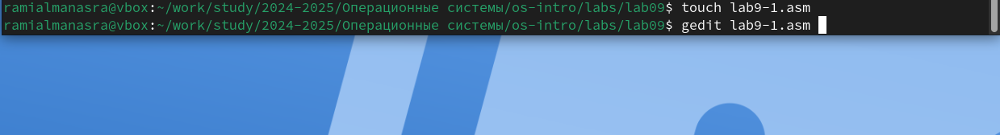{#fig:001 width=70%}

Я копирую код из листинга в файл, компилирую и запускаю его. Эта программа выполняет вычисление функции 2x+7 (Figure 2).

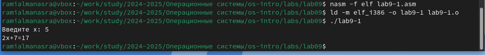{#fig:002 width=70%}

Изменяю текст программы, добавляя в него подпрограмму. Теперь она вычисляет значение функции для выражения f(g(x)) (Figure 3).

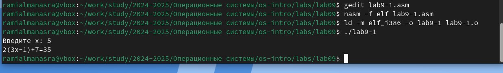{#fig:003 width=70%}

новый код программы:

```nasm
%include 'in_out.asm'
SECTION .data
msg: DB 'Введите x: ',0
result: DB '2(3x-1)+7=', 0

SECTION .bss
x: RESB 80
res: RESB 80

SECTION .text
GLOBAL _start
_start:
mov eax, msg
call sprint

mov ecx, x
mov edx, 80
call sread

mov eax, x
call atoi

call _calcul

mov eax, result
call sprint
mov eax, [res]
call iprintLF

call quit

_calcul:
push eax
call _subcalcul

mov ebx, 2
mul ebx
add eax, 7

mov [res], eax
pop eax
ret

_subcalcul:
mov ebx, 3
mul ebx
sub eax, 1
ret
```

### Отладка программам с помощью GDB

Копирую программу из второго листинга в созданный файл, и провожу трансляцию с ключом -g (Figure 4).

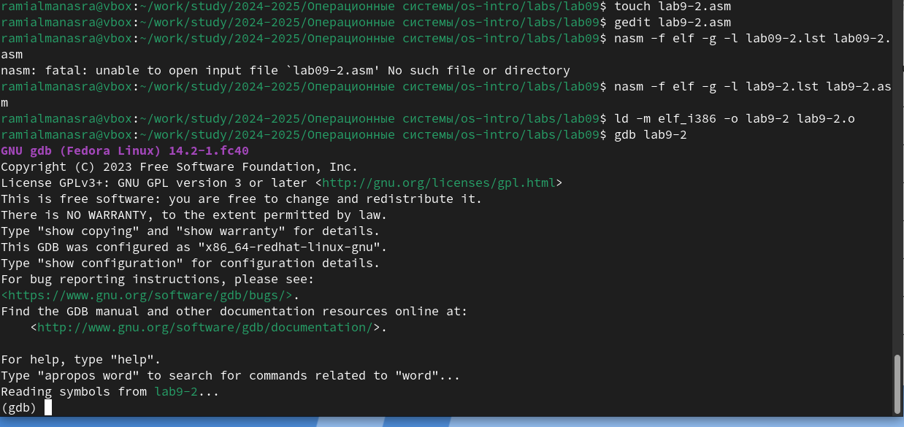{#fig:004 width=70%}

Запустив программу командой `run`, я убедился, что она работает корректно (Figure 5).

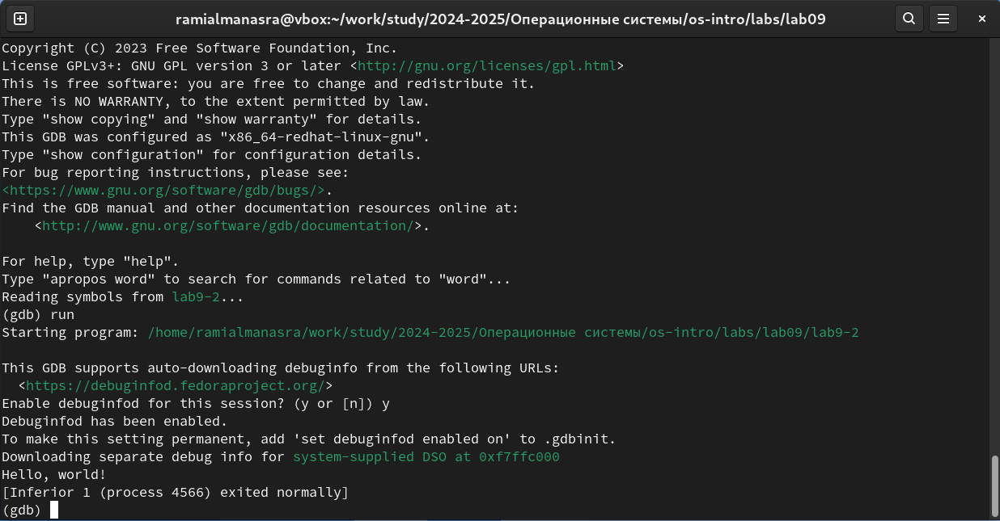{#fig:005 width=70%}

Для более подробного анализа программы установлю брейкпоинт на метку _start (Figure 6).

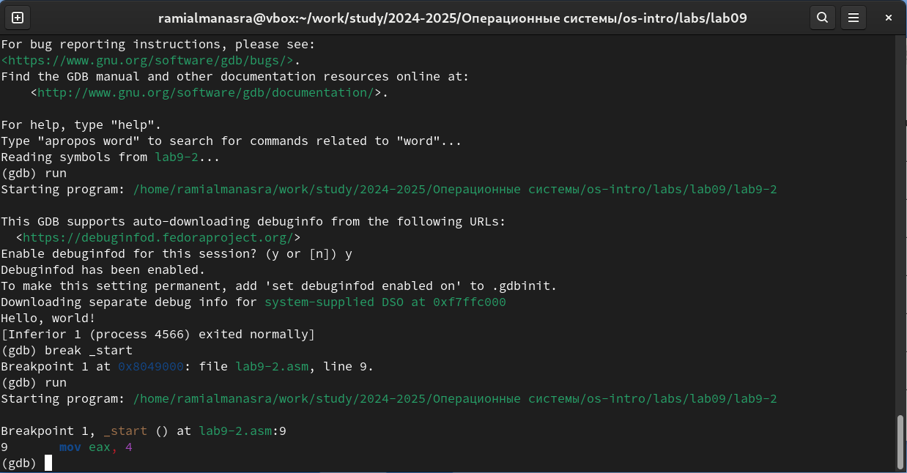{#fig:006 width=70%}

Далее я смотрю на дизассемблированный код программы, переведенный в команду с синтаксисом Intel (Figure 7).

Различия между синтаксисом ATT и Intel заключаются в порядке следования операндов (ATT: сначала исходный операнд; Intel: сначала целевой операнд), их размере (ATT: явно задается с помощью суффиксов; Intel: неявно определяется контекстом) и именах регистров (ATT: перед '%'; Intel: без префиксы).

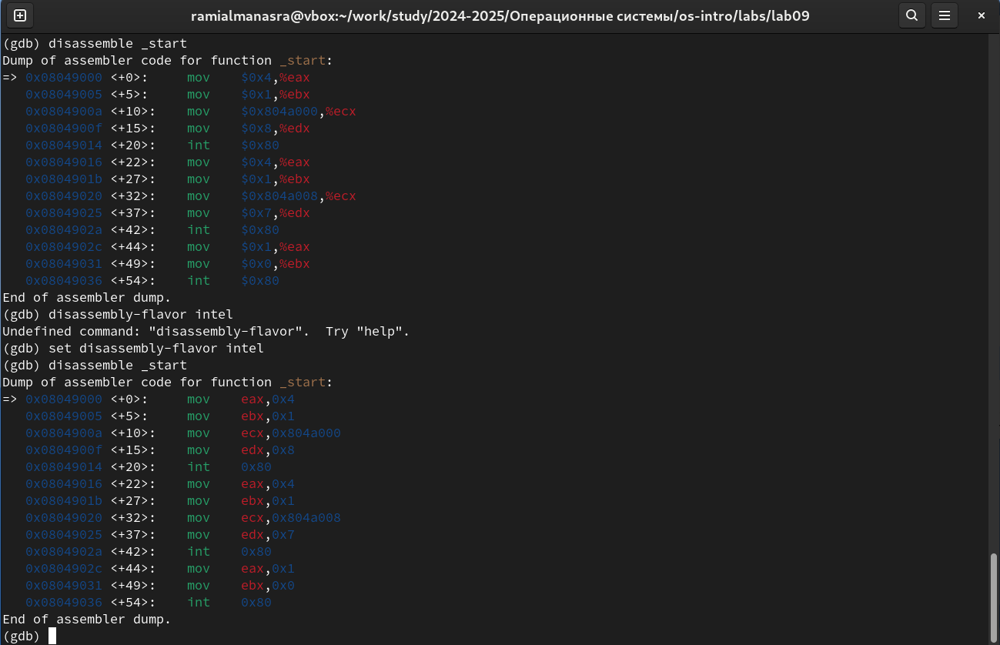{#fig:007 width=70%}

Включаю режим псевдографики для более удобного анализа программы (Figure 8).

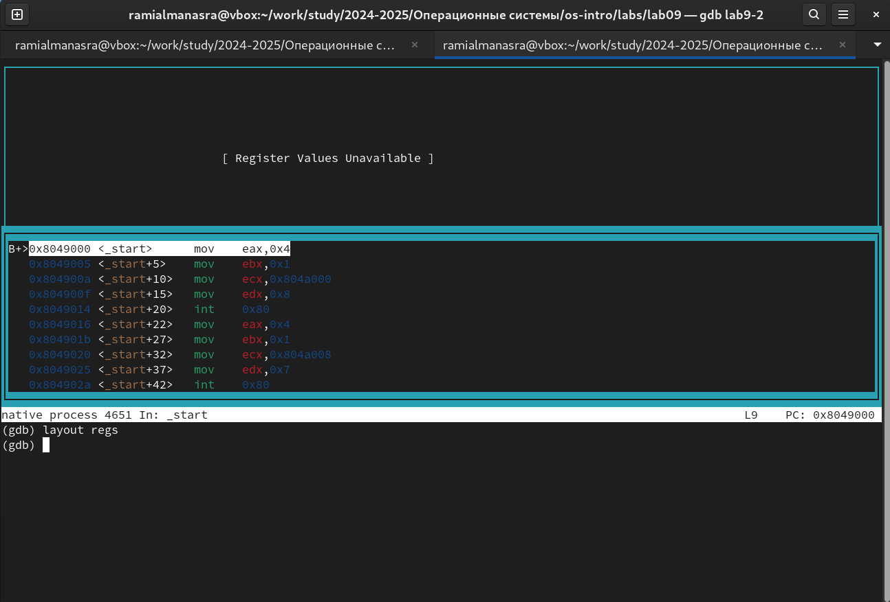{#fig:008 width=70%}

### Добавление точек останова

Я проверяю в псевдографическом режиме, сохранена ли точка останова (Figure 9).

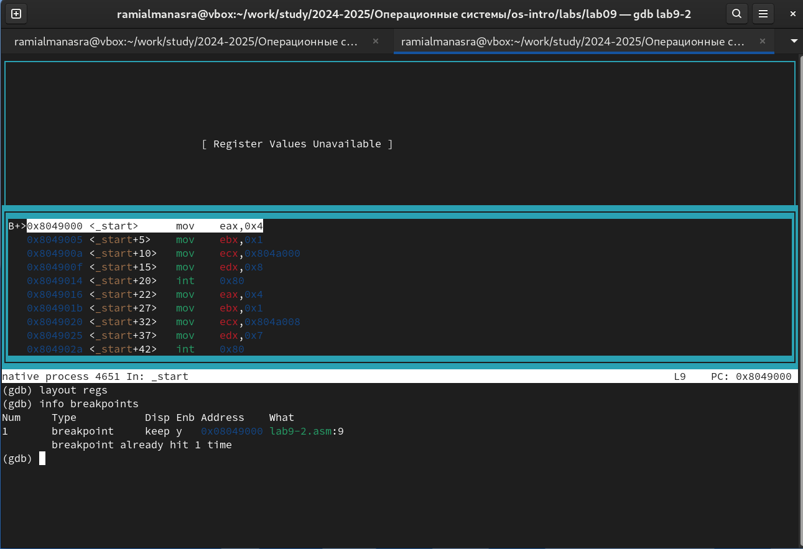{#fig:009 width=70%}

Установлю еще одну точку останова по адресу инструкции и смотрю информацию о всех установленных точках останова (Figure 10).

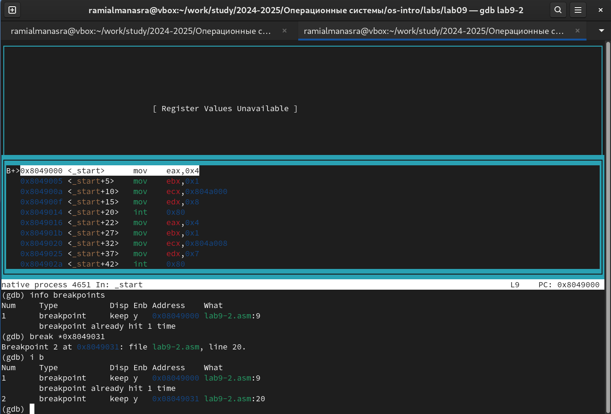{#fig:010 width=70%}

### Работа с данными программы в GDB

Я просматриваю содержимое регистров, используя команду `info registers` (Figure 11).

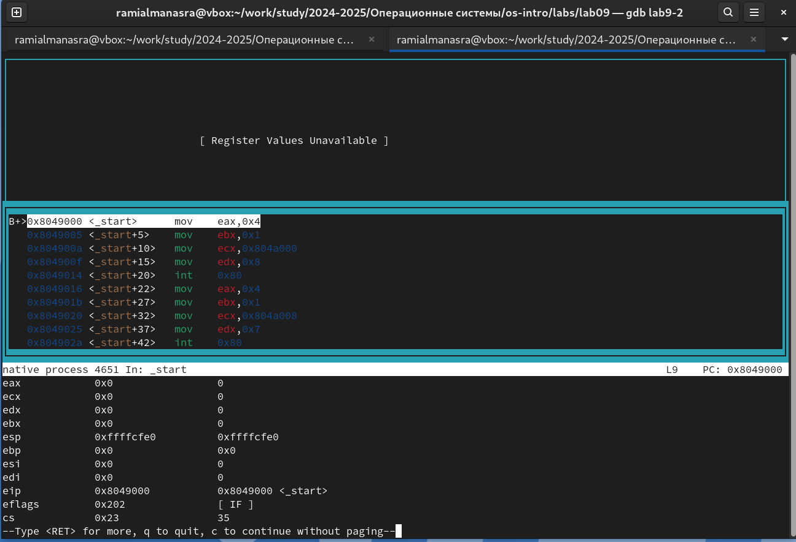{#fig:011 width=70%}

Я просматриваю содержимое переменных по имени и адресу (Figure 12).

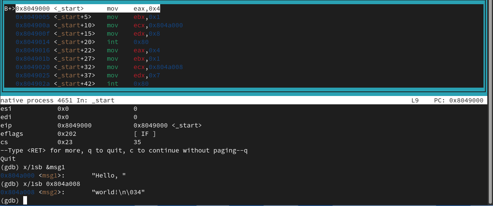{#fig:012 width=70%}

изменяю содержимое переменных(Figure 13).

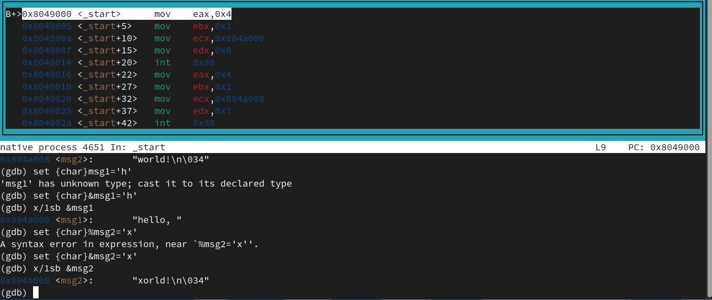{#fig:013 width=70%}

Я вывожу значение регистра `edx` в различных форматах и Используя команду "set", изменяю содержимое регистра "ebx" (Figure 14).

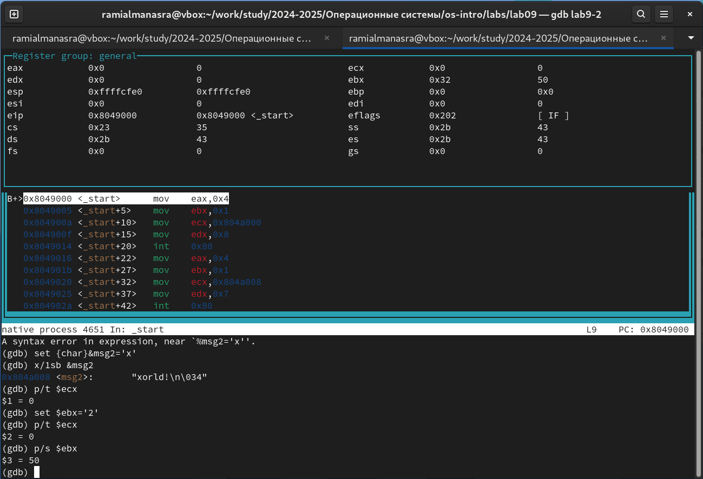{#fig:014 width=70%}

### Обработка аргументов командной строки в GDB

копирую программу из предыдущей лабораторной работы в текущий каталог и создаю исполняемый файл со списком и файлом отладки (Figure 16).

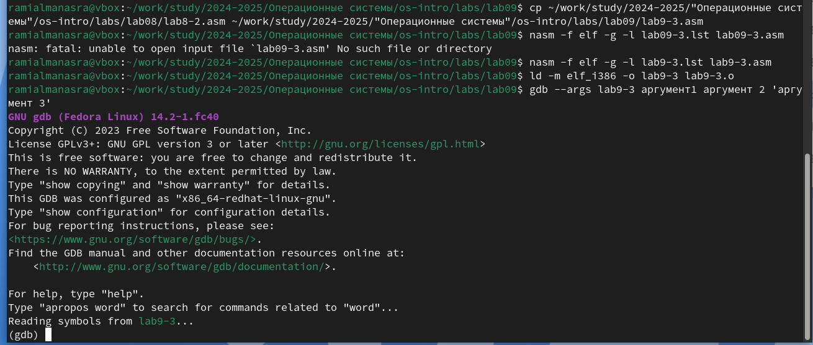{#fig:016 width=70%}

Я запускаю программу в режиме отладки, задавая аргументы, указываю точку останова и начинаю отладку. Я проверяю работу стека, изменяя аргумент команды для просмотра регистра `esp` на +4 (число определяется разрядностью системы, а указатель void занимает 4 байта); ошибка с аргументом +24 означает, что входные аргументы программы закончились. (Figure 17).

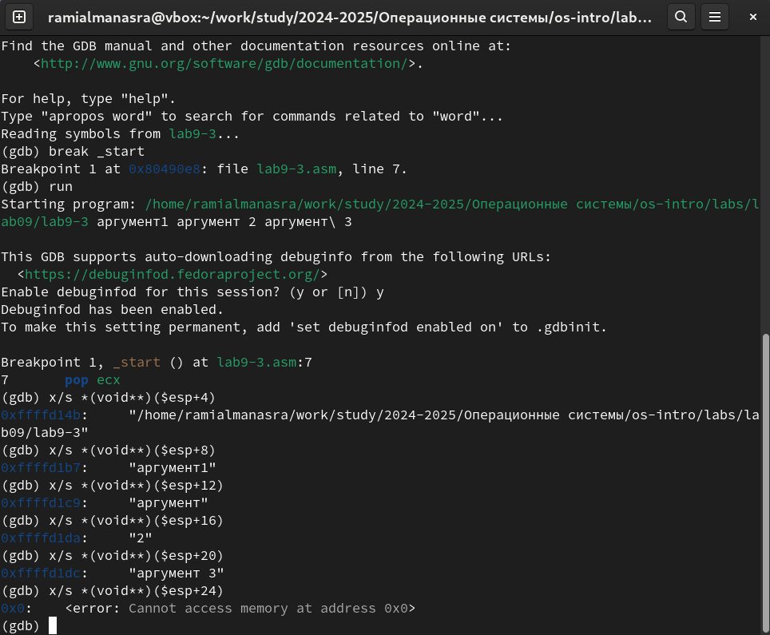{#fig:017 width=70%}

## Задание для самостоятельной работы

1. изменяю программу самостоятельной части предыдущей лабораторной работы с помощью подпрограммы (Figure 18).

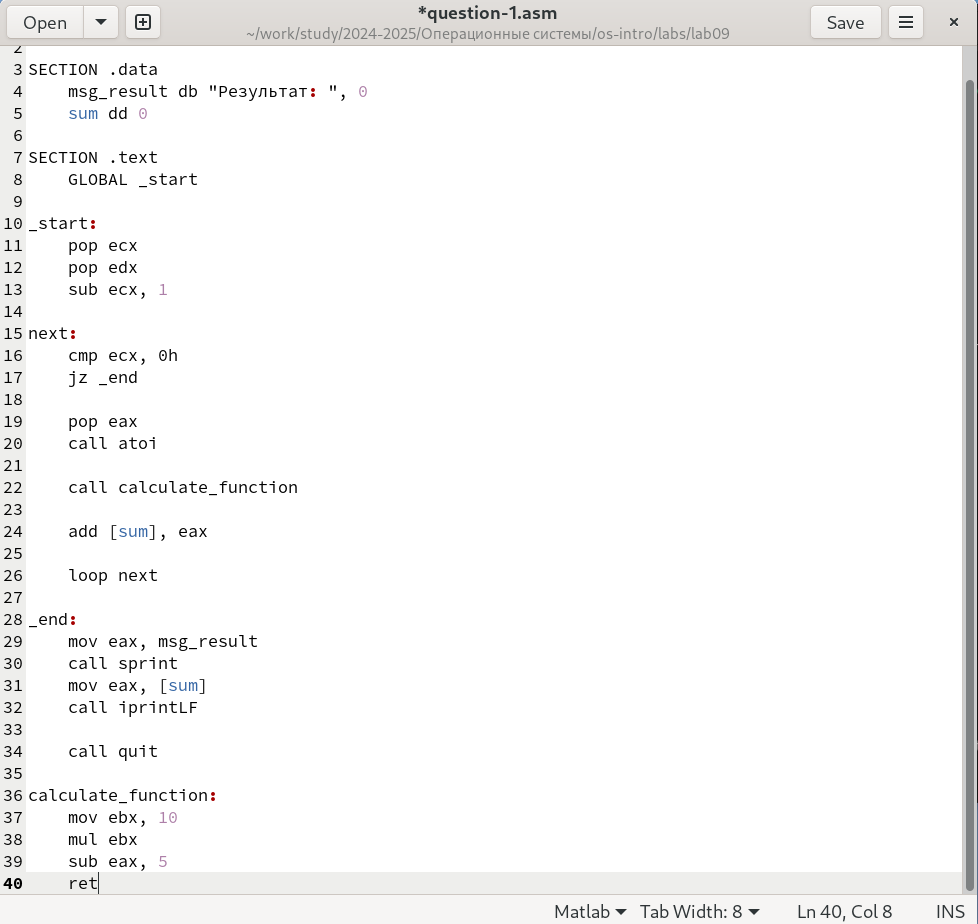{#fig:018 width=70%}

Запускаю программу и проверяю что работает (Figure 19).

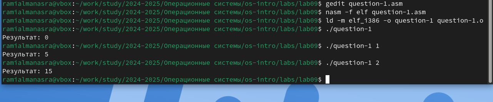{#fig:019 width=70%}

код программы:

```nasm
%include 'in_out.asm'

SECTION .data
    msg_result db "Результат: ", 0
    sum dd 0  

SECTION .text
    GLOBAL _start

_start:
    pop ecx
    pop edx
    sub ecx, 1

next:
    cmp ecx, 0h
    jz _end

    pop eax
    call atoi

    call calculate_function

    add [sum], eax

    loop next

_end:
    mov eax, msg_result
    call sprint
    mov eax, [sum]
    call iprintLF

    call quit

calculate_function:
    mov ebx, 10
    mul ebx
    sub eax, 5
    ret

```

2. Проверяю программу,С помощью отладчика GDB, анализируя изменения значений регистров. (Figure 20).
   Результат (3 + 2) сохраняется в ebx, но mul использует eax вместо ebx. Из-за этого результат неверный.

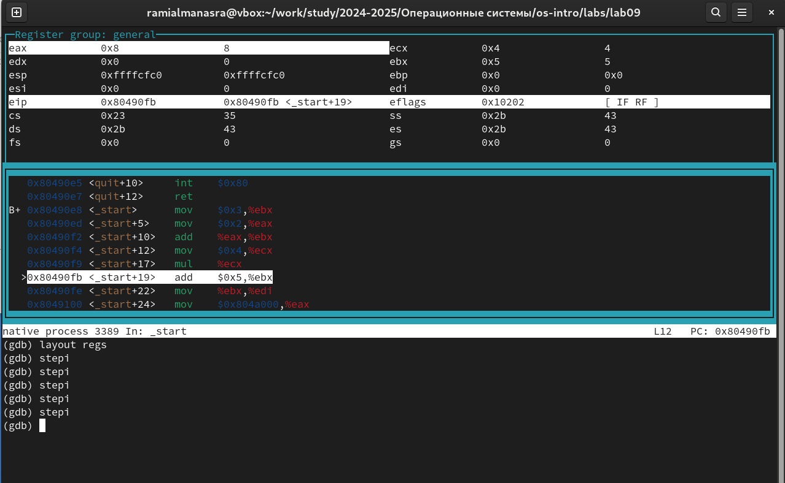{#fig:020 width=70%}

исправляю код программы (Figure 21).

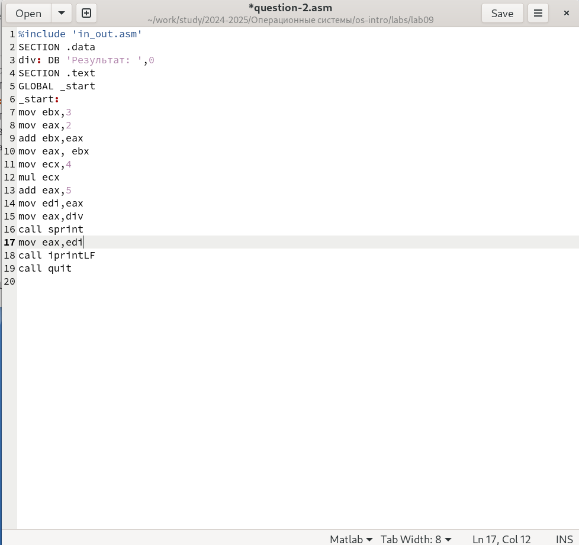{#fig:021 width=70%}

Теперь программа дает правильный результат (Figure 22).

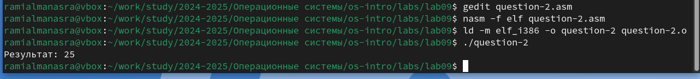{#fig:022 width=70%}

исправленный код:

```nasm
%include 'in_out.asm'
SECTION .data
div: DB 'Результат: ',0
SECTION .text
GLOBAL _start
_start:
mov ebx,3
mov eax,2
add ebx,eax
mov eax, ebx
mov ecx,4
mul ecx
add eax,5
mov edi,eax
mov eax,div
call sprint
mov eax,edi
call iprintLF
call quit
```

# Выводы

В результате выполнения этой лабораторной работы я приобрел навыки написания программ с использованием подпрограмм, а также познакомился с методами отладки с использованием GDB и его основными возможностями.

# Список литературы

1. [Course on TUIS](https://esystem.rudn.ru/course/view.php?id=112)
2. [Laboratory work No. 9](https://esystem.rudn.ru/pluginfile.php/2089096/mod_resource/content/0/%D0%9B%D0%B0%D0%B1%D0%BE%D1%80%D0%B0%D1%82%D0%BE%D1%80%D0%BD%D0%B0%D1%8F%20%D1%80%D0%B0%D0%B1%D0%BE%D1%82%D0%B0%20%E2%84%969.%20%D0%9F%D0%BE%D0%BD%D1%8F%D1%82%D0%B8%D0%B5%20%D0%BF%D0%BE%D0%B4%D0%BF%D1%80%D0%BE%D0%B3%D1%80%D0%B0%D0%BC%D0%BC%D1%8B.%20%D0%9E%D1%82%D0%BB%D0%B0%D0%B4%D1%87%D0%B8%D0%BA%20.pdf)
3. [Programming in NASM Assembly Language Stolyarov A. V.](https://esystem.rudn.ru/pluginfile.php/2088953/mod_resource/content/2/%D0%A1%D1%82%D0%BE%D0%BB%D1%8F%D1%80%D0%BE%D0%B2%20%D0%90.%20%D0%92.%20-%20%D0%9F%D1%80%D0%BE%D0%B3%D1%80%D0%B0%D0%BC%D0%BC%D0%B8%D1%80%D0%BE%D0%B2%D0%B0%D0%BD%D0%B8%D0%B5%20%D0%BD%D0%B0%20%D1%8F%D0%B7%D1%8B%D0%BA%D0%B5%20%D0%B0%D1%81%D1%81%D0%B5%D0%BC%D0%B1%D0%BB%D0%B5%D1%80%D0%B0%20NASM%20%D0%B4%D0%BB%D1%8F%20%D0%9E%D0%A1%20Unix.pdf)
