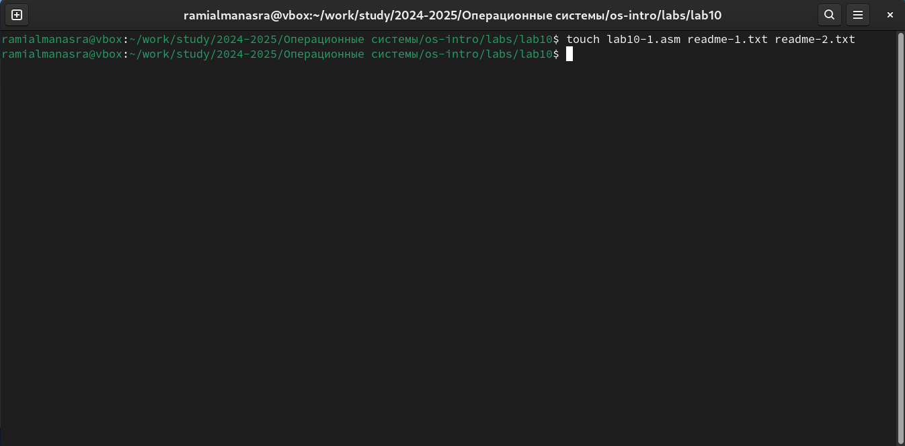
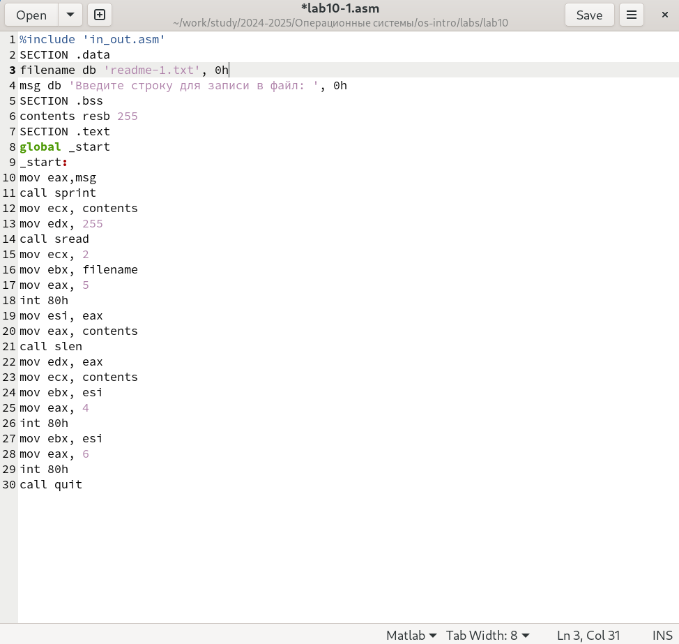
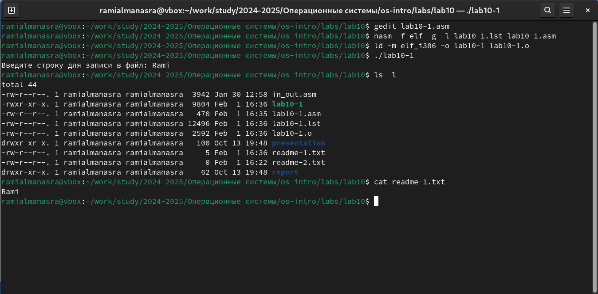
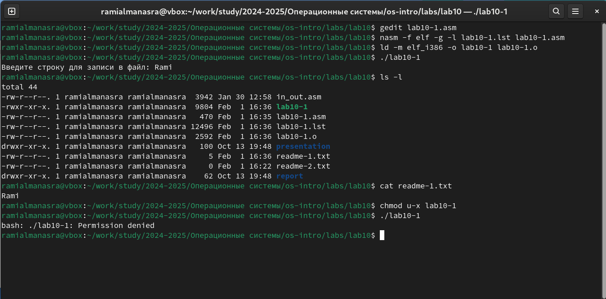
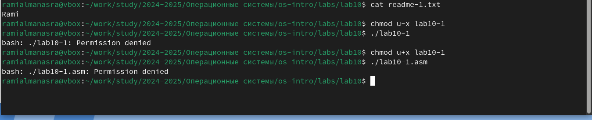
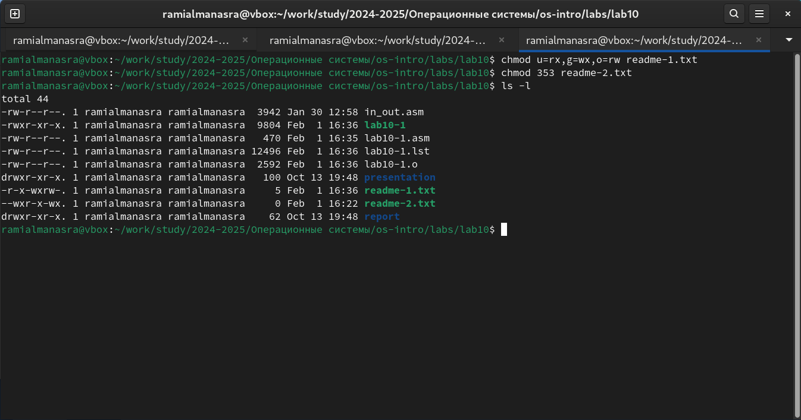
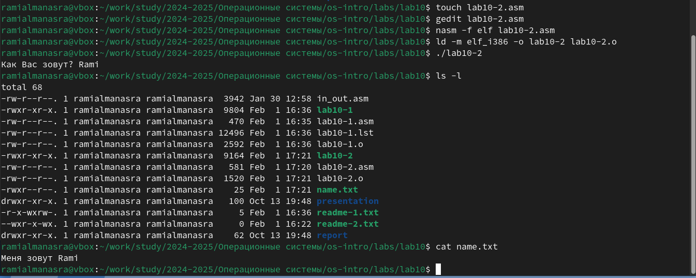

---
## Front matter
title: "Лабораторная работа №10"
subtitle: "Архитектура ЭВМ"
author: "Альманасра Рами"

## Generic otions
lang: ren-EN
toc-title: "Content"

## Bibliography
bibliography: bib/cite.bib
csl: pandoc/csl/gost-r-7-0-5-2008-numeric.csl

## Pdf output format
toc: true # Table of contents
toc-depth: 2
lof: true # List of figures
lot: true # List of tables
fontsize: 12pt
linestretch: 1.5
papersize: a4
documentclass: scrreprt
## I18n polyglossia
polyglossia-lang:
  name: russian
  options:
	- spelling=modern
	- babelshorthands=true
polyglossia-otherlangs:
  name: english
## I18n babel
babel-lang: russian
babel-otherlangs: english
## Fonts
mainfont: IBM Plex Serif
romanfont: IBM Plex Serif
sansfont: IBM Plex Sans
monofont: IBM Plex Mono
mathfont: STIX Two Math
mainfontoptions: Ligatures=Common,Ligatures=TeX,Scale=0.94
romanfontoptions: Ligatures=Common,Ligatures=TeX,Scale=0.94
sansfontoptions: Ligatures=Common,Ligatures=TeX,Scale=MatchLowercase,Scale=0.94
monofontoptions: Scale=MatchLowercase,Scale=0.94,FakeStretch=0.9
mathfontoptions:
## Biblatex
biblatex: true
biblio-style: "gost-numeric"
biblatexoptions:
  - parentracker=true
  - backend=biber
  - hyperref=auto
  - language=auto
  - autolang=other*
  - citestyle=gost-numeric
## Pandoc-crossref LaTeX customization
figureTitle: "Fig."
tableTitle: "Table"
listingTitle: "Listing"
lofTitle: "List of illustrations"
lotTitle: "List of Tables"
lolTitle: "Listings"
## Misc options
indent: true
header-includes:
  - \usepackage{indentfirst}
  - \usepackage{float} # keep figures where there are in the text
  - \floatplacement{figure}{H} # keep figures where there are in the text
---

# Цель работы

Приобретение навыков написания программ для работы с файлами.

# Задание

1. Создание файлов в программах.

2. Изменение прав доступа к файлам для разных групп пользователей.

3. Выполнение самостоятельных заданий по материалам лабораторной работы.

#  Теоретическое введение

ОС GNU/Linux является многопользовательской операционной системой. И для обеспечения защиты данных одного пользователя от действий других пользователей существуют специальные механизмы разграничения доступа к файлам. Кроме ограничения доступа, данный механизм позволяет разрешить другим пользователям доступ данным для совместной работы.

# Выполнение лабораторной работы

перехожу в каталог для программам лабораторной работы № 10 и создаю файлы lab10-1.asm, readme-1.txt и readme-2.txt. (Fig. -@fig:001).

{#fig:001 width=70%}

Ввожу в файл lab10-1.asm текст программы из листинга 10.1. Создаю исполняемый файл и проверяю его работу. (Fig. -@fig:002).

{#fig:002 width=70%}

Я запускаю программу; она запрашивает ввод строки, после чего создает текстовый файл со строкой, введенной пользователем (Fig. -@fig:003).

{#fig:003 width=70%}

С помощью команды chmod изменяю права доступа к исполняемому файлу lab10-1, запретив его выполнение. При запуске программы, выводится сообшение что у меня нет прав запускать программу, потому что я изменил права доступа. (Fig. -@fig:004).

{#fig:004 width=70%}

Я добавляю разрешение на выполнение исходного программного файла; исполняемый текстовый файл интерпретирует каждую строку как команду. Поскольку ни одна из строк не является командами bash, программа абсолютно ничего не делает (Fig. -@fig:005).

{#fig:005 width=70%}

Согласно моему варианту, мне нужно установить соответствующие разрешения для текстовых файлов:

1. В символьном виде для 1-го файла readme r-x -wx rw- 

2.  В двочной системе для 2-го файла readme 011 101 011. Я преобразую группу битов в восьмеричную систему счисления 3 5 3.

Пишу необходимые аргументы для chmod и проверяю правильность выполнения с помощью команды ls -l. (Fig. -@fig:006).

{#fig:006 width=70%}

## Задание для самостоятельной работы

Я пишу программу и компилирую ее. Программа должна отображать "Как Вас зовут?", запрашивать ввод с клавиатуры и создавать текстовый файл со строкой  “Меня зовут ...”, указанной при вводе пользователем.

Я запускаю программу, проверяю наличие и содержимое созданного текстового файла. Программа работает корректно (Fig. -@fig:007).

{#fig:007 width=70%}

Код программы:

```NASM

%include 'in_out.asm'

SECTION .data

filename db 'name.txt', 0

prompt db 'Как Вас зовут? ', 0

intro db 'Меня зовут ', 0

SECTION .bss

name resb 255

SECTION .text

global _start

_start:

mov eax, prompt

call sprint

mov ecx, name

mov edx, 255

call sread

mov eax, 8

mov ebx, filename

mov ecx, 0744o

int 80h

mov esi, eax

mov eax, intro

call slen

mov edx, eax

mov ecx, intro

mov ebx, esi

mov eax, 4

int 80h

mov eax, name

call slen

mov edx, eax

mov ecx, name

mov ebx, esi

mov eax, 4

int 80h

mov ebx, esi

mov eax, 6

int 80h

call quit

```

# Выводы

В процессе выполнения лабораторной работы я приобрел навыки написания программ для работы с файлами и научился редактировать права доступа к файлам.

# Список литературы

1. [Course on TUIS](https://esystem.rudn.ru/course/view.php?id=112)

2. [Programming in NASM Assembler Language Stolyarov A. V.](https://esystem.rudn.ru/pluginfile.php/2088953/mod_resource/content/2/%D0%A1%D1%82%D0%BE%D0%BB%D1%8F%D1%80%D0%BE%D0%B2%20%D0%90.%20%D0%92.%20-%20%D0%9F%D1%80%D0%BE%D0%B3%D1%80%D0%B0%D0%BC%D0%BC%D0%B8%D1%80%D0%BE%D0%B2%D0%B0%D0%BD%D0%B8%D0%B5%20%D0%BD%D0%B0%20%D1%8F%D0%B7%D1%8B%D0%BA%D0%B5%20%D0%B0%D1%81%D1%81%D0%B5%D0%BC%D0%B1%D0%BB%D0%B5%D1%80%D0%B0%20NASM%20%D0%B4%D0%BB%D1%8F%20%D0%9E%D0%A1%20Unix.pdf)

 
